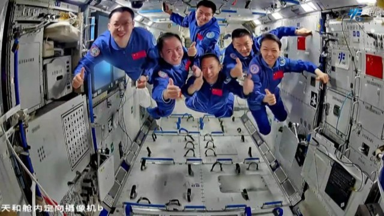

# Shenzhou-23 Crew Releases First In-Orbit Work Images; One Member to Attempt China's First Year-Long Space Station Stay

**Summary:** The China Manned Space Agency (CMSA) published the first batch of in-orbit work and life images from the Shenzhou-23 crew on June 7, 2026. Commander Zhu Yangzhu, pilot Zhang Zhiyuan, and payload specialist Lai Ka-ying have fully adapted to microgravity and are steadily advancing over 100 planned science experiments. One crew member will remain aboard the station across both the Shenzhou-23 and Shenzhou-24 missions, attempting China's first single-mission year-long space residency.

*Credit: China Manned Space Agency (CMSA)*

## Mission Background

Shenzhou-23 launched from the Jiuquan Satellite Launch Center on May 24, 2026, at 23:08 Beijing time atop a Long March 2F (Y23) rocket. The spacecraft docked with the radial port of the Tianhe core module on May 25 at 02:45 Beijing time, completing rendezvous and docking in approximately 3.5 hours. At 05:13 the same day, the Shenzhou-23 crew met the outgoing Shenzhou-21 crew in the eighth "space reunion" aboard the Chinese Space Station. After several days of joint operations and in-orbit handover, the Shenzhou-21 crew returned to Earth.

## First In-Orbit Images

The images released on June 7 show the three astronauts conducting space science experiments, operating equipment, eating in microgravity, and relaxing inside the station. They also document the historic moment when all six astronauts — both the Shenzhou-23 and Shenzhou-21 crews — worked together inside the Tianhe core module during the handover period.

All three crew members appear to be in good physical condition and have fully adapted to the microgravity environment.

## China's First Year-Long Residency Experiment

The most notable scientific objective of this mission is the plan for one crew member to span both the Shenzhou-23 and Shenzhou-24 missions, remaining aboard the station for approximately one year. This will be China's first single-mission year-long space residency test.

According to the May 23 pre-launch press conference, the core purposes of the year-long experiment include:

- **Implementing China's first "Space Human Body Research Plan"**, collecting comprehensive physiological data under longer-duration flight conditions
- **Verifying astronaut health protection capabilities for long-term flight**, improving in-orbit medical monitoring and protection systems

Since Shenzhou-13, eight astronaut crews have completed six-month stays aboard the station, and some astronauts have accumulated close to a year of total in-orbit time across multiple missions. However, a single year-long mission represents an untested milestone for China's human spaceflight program.

## Crew Composition

| Astronaut | Role | Background |
| ----------- | ------ | ------------ |
| Zhu Yangzhu | Commander / Flight Engineer | Previous in-orbit experience |
| Zhang Zhiyuan | Pilot | Military pilot background |
| Lai Ka-ying | Payload Specialist | Hong Kong's first astronaut; former HK police officer |

Lai Ka-ying's selection marks the first time an astronaut from the Hong Kong Special Administrative Region has been admitted into China's human spaceflight program.

## Science Program

The Shenzhou-23 mission includes over 100 planned science and technology experiments across several frontier fields:

- **Space life sciences**: Zebrafish embryos, mouse embryos, and stem-cell "artificial embryos" for space embryology research
- **Space materials science**
- **Microgravity fluid physics**
- **Aerospace medicine**
- **New aerospace technologies**: In-orbit verification of new-type space energy storage batteries

## Upcoming EVA

According to Chinese media reports, the Shenzhou-23 crew is expected to perform an extravehicular activity (EVA) in the coming weeks after completing the current phase of science experiments.

## Sources (original pages)

- [China Manned Space Agency (CMSA) official release](http://www.cmse.gov.cn)
- [Qianlong: Latest life and work images of Shenzhou-23 crew published](https://china.qianlong.com/2026/0608/8680088.shtml)
- [Sohu: First batch of Shenzhou-23 crew images revealed](https://www.sohu.com/a/1033404203_362225)
- [Sohu: Shenzhou-23 crew's first in-orbit images — who will fly for one year?](https://www.sohu.com/a/1033670357_100158206)
