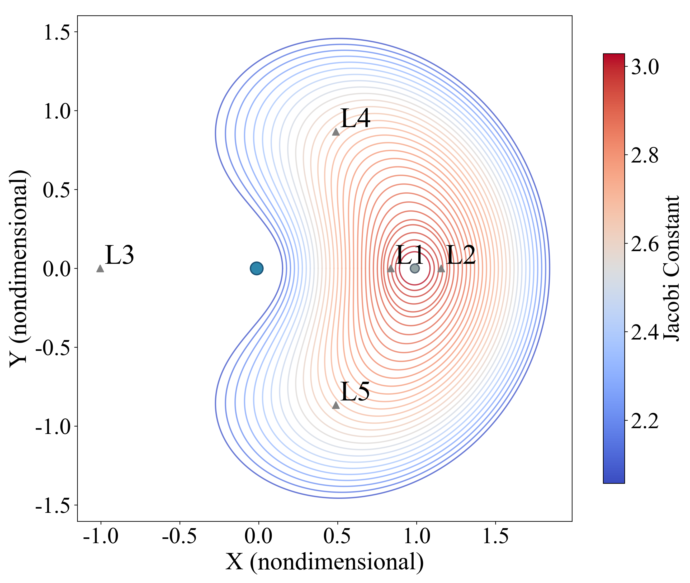
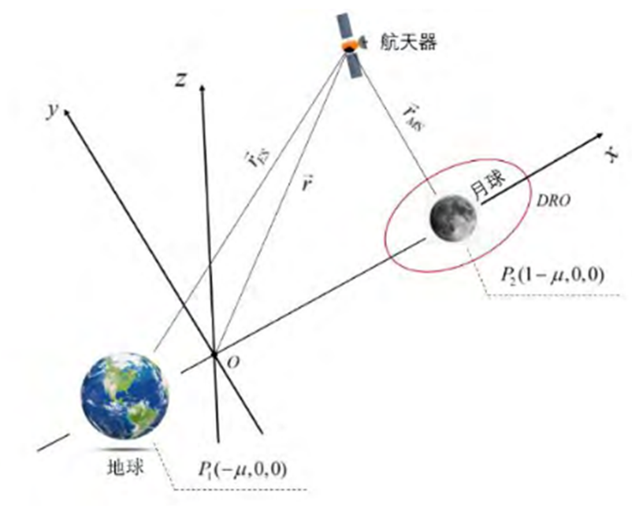

# 远距离逆行轨道

> 本文作者：[天疆说](https://blog.csdn.net/qq_33254264)
>
> 本站地址：[https://cislunarspace.cn](https://cislunarspace.cn)

## 定义

远距离逆行轨道（Distant Retrograde Orbit，DRO）是圆形限制性三体问题（CRTBP）中一类环绕月球的**稳定周期轨道**。在会合坐标系中，DRO 的运行方向与月球绕地球公转方向相反，因此称为"逆行"轨道。DRO 属于月心轨道（Moon-Centered Orbits）家族，与 DPO（远距离顺行轨道）、LoPO（低顺行轨道）共同构成了地月空间月心周期轨道的主要类别。

*DRO 在地月会合坐标系中的轨道形态*

*DRO 在质心旋转坐标系中的几何构型*

## 几何特征

在会合坐标系下，平面 DRO 表现为近似椭圆的闭合曲线，以月球为几何中心。其主要参数为：

- **$x$ 方向振幅 $A_x$**：轨道与地月连线的交点到月球的距离，是描述 DRO 构型的主要参数
  - 当 $A_x$ 较小时，DRO 靠近月球，近似于环月圆轨道
  - 随 $A_x$ 增大，DRO 逐渐远离月球，轨道形态从近圆形演变为具有明显偏心率的椭圆形
- **$z$ 方向振幅 $A_z$**：引入 $z$ 方向振幅可获得三维非平面 DRO，这类轨道同时具有 $xOy$ 平面内的逆行运动和 $z$ 方向的周期振荡

## 共振关系

DRO 存在与月球公转周期的共振关系。当 DRO 的轨道周期 $T$ 与月球公转周期 $T_M$ 满足 $T/T_M \approx n/m$（$n, m$ 为正整数）时，称为 $m:n$ 共振 DRO。

| 共振比 | 特征 |
|:---|:---|
| 1:1, 2:1（低阶共振） | 靠近月球，稳定性较强 |
| 3:1, 4:1（高阶共振） | 远离月球，轨道幅值较大，为向近地空间的转移提供更大势能优势 |

例如，2:1 共振 DRO 的轨道周期约为月球公转周期的一半，即飞行器每绕月球运行两圈时月球恰好公转一圈。

## 动力学对称性

在 CRTBP 中，DRO 关于 $x$ 轴具有动力学对称性：轨道在穿越 $x$ 轴时，仅存在 $y$ 方向速度分量 $\dot{y}_0$，而 $y$ 方向位置和 $x$、$z$ 方向速度均为零。这一对称性使得只需在 $x$ 轴上选取初始点，以 $\dot{y}_0$ 和周期 $T$ 为自由变量，通过半周期积分后校核轨道是否返回 $x$ 轴，即可迭代收敛至闭合的周期轨道。

## 轨道参数特征

以地月系统为例，DRO 轨道族的主要参数范围如下（基于 Guzzetti 等人的动态目录统计）：

| 参数 | 范围 |
|:---|:---|
| Jacobi 常数 | 1.4352 ~ 3.0180（均值 2.1184） |
| 轨道周期 | 5.87 ~ 27.38 天（均值 24.63 天） |
| 稳定性指数 | 1.0000 ~ 1.0002（均值 1.0001） |

DRO 的稳定性指数极其接近 1.0，表明该轨道族具有卓越的长期稳定性，是地月空间中极少数天然稳定的周期轨道之一。

## 在星历模型中的表现

在星历模型等多摄动环境下，由于天体位置随时间变化，DRO 不再保持严格周期性，而演变为在有限区域内缠绕的**准周期轨道**（Quasi-periodic Orbit），其轨迹不闭合，但整体形态保持稳定。

## 操作成本分析

### 从 LEO 的轨道插入

从 300 km 高度的 LEO 出发，到达 DRO 的典型转移方案包括：

- **直接双脉冲转移**：仅包含两次脉冲机动——一次从 LEO 出发，一次插入 DRO。直接转移的飞行时间约为 5.4 ~ 7.2 天
- **月球借力三脉冲转移**：在 200 km 月球近地点距离处增加一次中途机动，利用月球引力辅助降低总 $\Delta V$ 成本

Guzzetti 等人的研究表明，DRO 的直接插入 $\Delta V$（$\Delta V_{POI}$）在所有平动点轨道和月心轨道中属于较低水平，平均约为数百 m/s 量级。这使得 DRO 成为从 LEO 可达性较好的地月空间轨道之一。

### 轨道维持成本

DRO 的轨道维持成本极低：

- 基于 Monte Carlo 仿真的长期维持策略评估显示，DRO 的年平均速度增量需求仅为数 m/s 量级
- 维持机动通常在 $x$ 轴或 $xOy$ 平面穿越处实施，这些位置便于实际操作且成本接近全局最优
- DRO 的卓越稳定性意味着即使存在初始状态误差（位置 1 km，速度 1 cm/s 标准差）和机动执行误差（1% 标准差），轨道仍能在较长时间内保持良好特性

## 应用价值

DRO 凭借其出色的长期稳定性（无需或仅需极少量轨道机动即可维持）和轨位优势，已成为地月空间基础设施的优选任务轨道，应用场景包括：

- **态势感知星座**部署
- **地月空间导航系统**组网
- **深空中继通信**
- **物资储备与战略驻留**

NASA 的月球轨道器（LRO）任务已验证了 DRO 在月球探测中的应用价值。近年有学者提出，具备 $z$ 方向振幅的非平面 DRO 可规避日食，进一步提升观测器效能。

在 Guzzetti 等人提出的动态目录框架中，DRO 被列为月球附近长期空间基础设施的优选候选轨道，主要优势包括：

- **有利的几何构型**：靠近月球，便于支持月球表面操作和通信
- **低维持成本**：卓越的稳定性使得轨道维持预算极小
- **低插入成本**：从 LEO 的直接转移 $\Delta V$ 较低
- **可及性**：飞行时间适中（约 5.4 ~ 7.2 天），适合载人任务

## 在 A2PPO 低推力转移研究中的应用

Ul Haq 等人（2026）使用 A2PPO（注意力增强近端策略优化）算法研究了从 L₂ NRHO 到月球 DRO 的自主低推力转移（S3 场景）：

- **出发轨道**：L₂ 南 NRHO（$C_J \approx 3.0395$，周期 6.99 天）
- **目标轨道**：月球 DRO（$C_J \approx 2.9981$，周期 6.95 天）
- **转移结果**：7.60 天，消耗 5.10 kg 推进剂
- **转移特性**：形成月球借力飞行结构，轨道逐步从顺行转变为逆行

NRHO 与 DRO 之间的转移设计是低推力轨迹优化中的难题：两种轨道位于不同的动力学通道之间，不存在简单的流形连接路径。A2PPO 在无需初始猜测的情况下，自主学习到了与直接配点法高度一致（7.63 天 / 5.11 kg）的转移轨迹。

## 相关概念
- [近直线晕轨道（NRHO）](/glossary/orbits/nrho/)
- [地月 L1/L2 晕轨道（EML1/EML2 Halo）](/glossary/orbits/eml-halo/)
- [远距离顺行轨道（DPO）](/glossary/orbits/dpo/)
- [低顺行轨道（LoPO）](/glossary/orbits/lopo/)
- [圆形限制性三体问题（CR3BP）](/glossary/dynamics/cr3bp/)
- [星历模型](/glossary/dynamics/ephemeris-model/)
- [A2PPO（注意力增强近端策略优化）](/glossary/dynamics/a2ppo/)
- [星伞（Starshade）](/glossary/other/starshade/)
- [Birkhoff-Gustavson 标准型](/glossary/dynamics/birkhoff-gustavson/)
- [Poincaré 截面（Poincaré Section）](/glossary/dynamics/poincare-section/)
- [共振轨道](/glossary/orbits/resonance-orbit/)
- [拟周期轨道](/glossary/orbits/quasi-periodic-orbit/)

## 核心要素

### 轨道定义

远距离逆行轨道（DRO）是 CRTBP 中一类环绕月球的稳定周期轨道，在会合坐标系中运行方向与月球绕地球公转方向相反。主要参数包括 x 方向振幅 $A_x$（描述轨道构型）和 z 方向振幅 $A_z$（引入三维非平面 DRO）。

### 动力学特性

- **长期稳定性**：无需或仅需极少量轨道机动即可维持
- **共振关系**：与月球公转周期存在 1:1、2:1、3:1 等共振比
- **动力学对称性**：关于 x 轴对称，穿越 x 轴时仅存在 y 方向速度分量
- **星历模型表现**：演变为在有限区域内缠绕的准周期轨道

### 设计方法

- **初始条件获取**：利用动力学对称性在 x 轴上选取初始点，以 $\dot{y}_0$ 和周期 T 为自由变量迭代收敛
- **延拓方法**：从 1:1 共振小振幅 DRO 延拓至高阶共振大振幅 DRO
- **星历模型转换**：通过二级微分修正法将 CR3BP 轨道转换至星历模型

## 参考文献

- Whitley R, Martinez R. Options for staging orbits in cislunar space[C]. 2016.
- Broucke R. Periodic orbits in the restricted three-body problem with Earth-Moon masses[R]. 1968.
- 陈昱桔. 面向地月空间态势感知的DRO轨道设计与控制研究[D]. 2024.
- Genszler G, Savransky D, Soto G J. Surveying orbits in cislunar space for telescope-starshade observatories[J]. 2026.
- Qiao C, Long X, Yang L, et al. Orbital parameter characterization and objects cataloging for Earth-Moon collinear libration points[J]. Chinese Journal of Aeronautics, 2025. doi: 10.1016/j.cja.2025.103869.
- Ul Haq I U, Dai H, Du C. Autonomous low-thrust trajectory optimization in cislunar space via attention-augmented reinforcement learning[J]. Aerospace Science and Technology, 2026.
- Guzzetti D, Bosanac N, Howell K C. A framework for efficient trajectory comparisons in the Earth-Moon design space[C]. AAS/AIAA Space Flight Mechanics Meeting, 2014.
- Folta D, Bosanac N, Guzzetti D, et al. An Earth-Moon system trajectory design reference catalog[C]. 2nd IAA Conference on Dynamics and Control of Space Systems, 2014.
