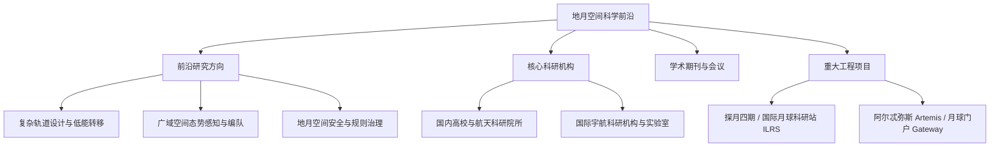

# 地月空间科学研究前沿

随着全球探月工程从早期的单一飞掠与采样探测，迈向常态化驻留、地月基础设施建设与空间资源利用的新阶段，地月空间已成为国际深空探测与宇航科学竞争与合作的最前沿阵地。

本栏目系统梳理地月空间的核心学术前沿、科研阵地、学术交流平台与重大工程计划，为研究人员与工程技术团队提供全面的研究导引与全局视野。

## 栏目知识结构

## 板块导引

| 板块 | 核心内容 | 深入链接 |
| :--- | :--- | :--- |
| **研究前沿方向** | 涵盖现代多体轨道动力学、广域态势感知、自主导航与星座编队、空间治理等核心热点 | [浏览前沿方向](/research-frontiers/directions/) |
| **主要科研机构** | 汇集国内主要高校（北航、清华、哈工大、南大等）、航天科技与科工院所及国际顶尖实验室 | [查看科研机构](/research-frontiers/institutions/) |
| **学术期刊与会议** | 整理宇航学报、AAS/AIAA 会议、Advances in Space Research 等权威投稿与追踪渠道 | [查阅期刊与会议](/research-frontiers/journals-conferences) |
| **重大工程项目** | 跟踪我国探月工程（嫦娥系列、鹊桥中继）、ILRS 以及 Artemis 等战略级工程进展 | [跟踪重大项目](/research-frontiers/major-projects) |

## 交叉查阅建议

- **理论深化**：在探讨前沿方向的轨道动力学算法时，可同步查阅 [背景知识](/background/) 中的数学工具与最优控制理论。
- **概念核验**：针对前沿论文中的各类专有名词与缩略语，请交叉检索 [术语词典](/glossary/)。
- **算法复现**：研究前沿方向涉及的数值工具与开源动力学库，可直接在 [资源与工具](/resources-tools/) 中获取。
