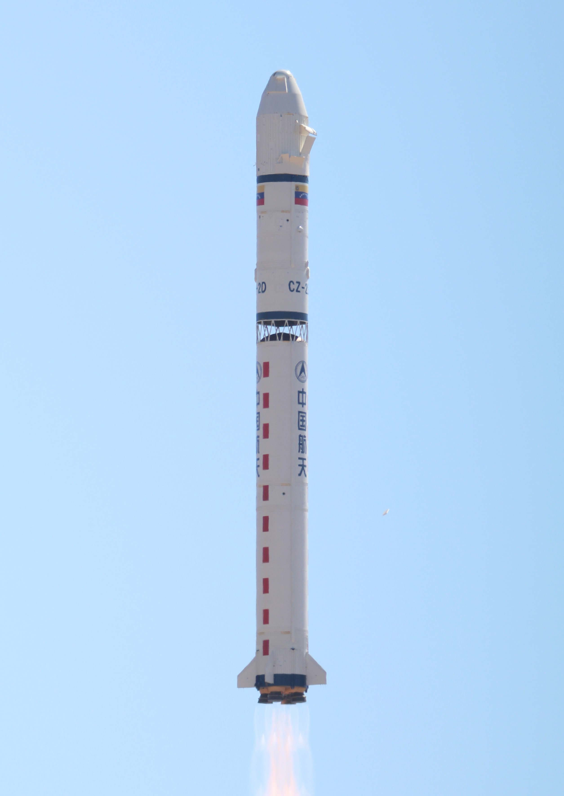

# 我国成功发射四维高景二号05、06星

**摘要：** 据中国航天科技集团通过观察者网等媒体的转述，**2026 年 3 月 26 日 6 时 51 分**，**长征二号丁**运载火箭在 **太原卫星发射中心** 点火升空，将 **四维高景二号 05、06 星** 送入预定轨道，任务圆满成功。双星由中国四维商业运营、航天科技集团八院抓总研制，入轨后与在轨的 03、04 星形成「四星两组」协同组网；本次任务为 **长征系列运载火箭第 634 次** 飞行。任务中 **长二丁** 首次配套 **最大直径 4.2 米复合材料整流罩**，并首次正式使用 **贮箱外壁无线测温系统**。

*图示说明：为展示长征二号丁典型发射场景而选用维基共享资源已授权图片；**并非** 2026-03-26 太原任务官方首发照片，请以权威发布为准。*

## 信息来源（原文）

- 观察者网：[我国成功发射四维高景二号05、06星](https://www.guancha.cn/industry-science/2026_03_26_811443.shtml)（来源：微信公众号「中国航天科技集团」）
- 文首示意图（维基共享资源，非本次任务实拍）：[File:Long March 2D launching VRSS-1.jpg](https://commons.wikimedia.org/wiki/File:Long_March_2D_launching_VRSS-1.jpg)（CC BY 2.0，作者见文件页）
