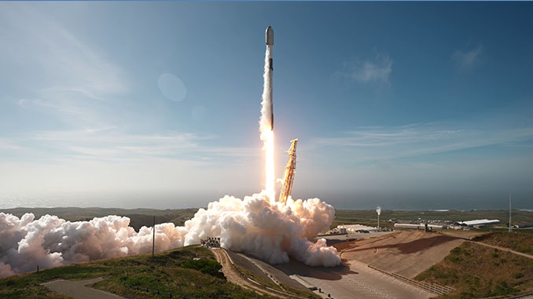

# SpaceX 自范登堡发射 Starlink 17-17 任务

**摘要：** 据 *Spaceflight Now* 报道，**2026 年 3 月 26 日** **Starlink 17-17** 任务由 **猎鹰 9 号** 自 **加利福尼亚州范登堡太空军基地** **SLC-4E** 发射升空，当地时间 **16:03:19 PDT**（约 **23:03:19 UTC**），箭上搭载 **25 颗** Starlink 卫星；一级助推器 **B1081** 完成第 **23** 次飞行并在海上无人船 **「Of Course I Still Love You」** 上回收。二级于飞行约 **1 小时后** 投放卫星。任务曾因载荷或火箭原因较 **3 月 24 日** 计划推迟两天。

*图示说明：图片来自 Spaceflight Now 报道所引用的 **SpaceX** 发布画面，与当次任务一致。*

## 信息来源（原文）

- Spaceflight Now：[SpaceX launches batch of Starlink satellites from the West Coast](https://spaceflightnow.com/2026/03/26/spacex-to-launch-batch-of-starlink-satellites-from-the-west-coast/)（配图：SpaceX）
