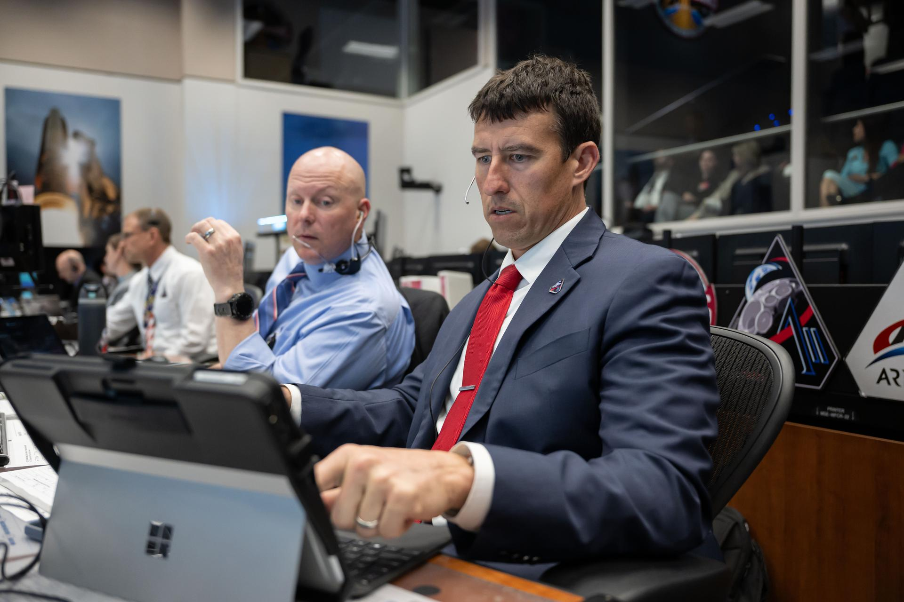

# Artemis II 飞行第 2 天：TLI 燃烧成功完成，猎户座正式踏上月球之旅

*Credit: NASA（公共领域）*

**摘要：** 据 *NASA* 报道，猎户座飞船服务模块主发动机于美东时间 **19:49** 点火 **5 分 50 秒**，成功完成**地月转移注入燃烧（TLI）**。四名航天员已脱离地球轨道，正式踏上飞向月球的旅程——这是 **1972 年阿波罗 17 号以来**人类首次飞向月球。

## TLI 燃烧数据

- **发动机推力**：最大 6,000 磅（约 27 kN），足以在 2.7 秒内将一辆汽车从 0 加速到 60 mph
- **燃烧时飞船质量**：约 58,000 磅
- **燃料消耗**：约 1,000 磅
- **结果**：猎户座成功脱离地球轨道，进入地月转移轨道

## 乘组活动

乘组使用飞船上的**飞轮健身装置**进行了首次在轨锻炼。该装置仅重 **30 磅**，大小约等于一个登机箱，却能提供最高 **400 磅**的阻力负荷，支持划船、深蹲、硬拉等训练。相比之下，国际空间站上的锻炼设备总重超过 4,000 磅、占用约 850 立方英尺空间。

地面团队同步监测了飞船的**空气再生系统**，评估锻炼对飞船姿态运动的影响。

乘组还成功检查了 **AVATAR 科学载荷**。

## 通信中断说明

工程师确认，发射后入轨阶段出现的短暂双向通信中断是由地面 **TDRS（跟踪与数据中继卫星）系统**配置问题引起，已快速修复，未影响任务运行。

## 月球飞越观测计划

月球科学团队已开始制定**月球目标观测计划（Lunar Targeting Plan）**，为预计 **4 月 6 日（周一）** 约 6 小时的月球飞越观测做准备：

- 记录陨石坑、古熔岩流、月壳裂缝与山脊等地质特征
- 帮助科学家理解月球和太阳系的形成过程
- 飞越末段将观测一次持续近 **1 小时的日食**现象——太阳将从猎户座视角被月球遮挡

## 信息来源（原文）

- NASA：[Artemis II Flight Day 2: Orion Completes TLI Burn, Crew Begins Journey to the Moon](https://www.nasa.gov/blogs/missions/2026/04/02/artemis-ii-flight-day-2-orion-completes-tli-burn-crew-begins-journey-to-the-moon/)
- NASA：[Artemis II Flight Day 2: Crew, Houston Poll 'Go' for Translunar Injection Burn](https://www.nasa.gov/blogs/missions/2026/04/02/artemis-ii-flight-day-2-crew-houston-poll-go-for-translunar-injection-burn/)

---
