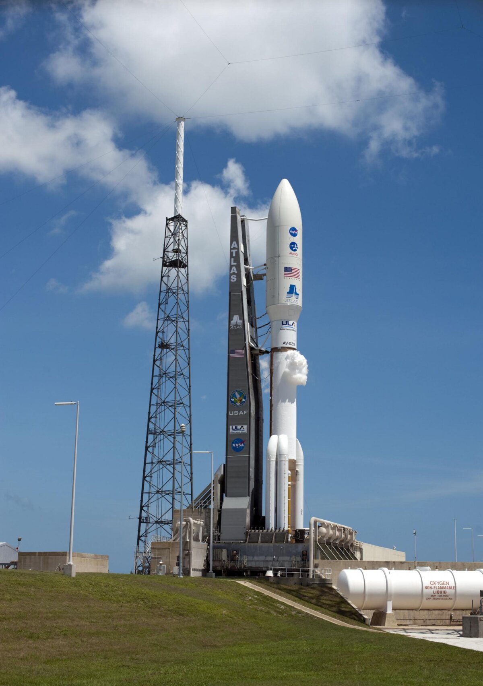

# Atlas V 成功发射 Amazon Leo 第五批 29 颗卫星，柯伊伯星座加速组网

**摘要：** 联合发射联盟（ULA）Atlas V 551 火箭于美国东部时间 4 月 4 日凌晨 1:46 从卡纳维拉尔角天军站 SLC-41 工位升空，成功执行 Amazon Leo LA-05 任务，将 29 颗 Amazon Leo（前 Project Kuiper）宽带互联网卫星送入低地球轨道。这是 Amazon Leo 星座第五批发射，标志着亚马逊卫星互联网计划正在加速推进。

*Credit: ULA*

## 任务概况

Amazon Leo（原 Project Kuiper）是亚马逊旗下的大型低轨卫星互联网星座，计划由 3,276 颗卫星组成，分布在 98 个轨道面上，轨道高度分别为 590 km、610 km 和 630 km。本次 LA-05 任务携带 29 颗卫星，由 ULA 的 Atlas V 551 构型执行发射。

Atlas V 551 是 Atlas V 系列中运载能力最强的构型之一，配备 5 米整流罩、5 个固体助推器和单发动机半人马座上面级，非常适合大型星座的批量部署任务。

## 星座进展

Amazon Leo 计划旨在为全球偏远和服务不足的地区提供高速、低延迟的宽带互联网接入。随着 LA-05 任务的完成，星座在轨卫星数量进一步增加，亚马逊正按计划推进其大规模星座部署时间表。

## 信息来源

- [ULA 官网](https://www.ulalaunch.com/)
- [Amazon Leo 官网](https://leo.amazon.com/)
- [Next Spaceflight - Atlas V 551 | Amazon Leo LA-05](https://nextspaceflight.com/)
