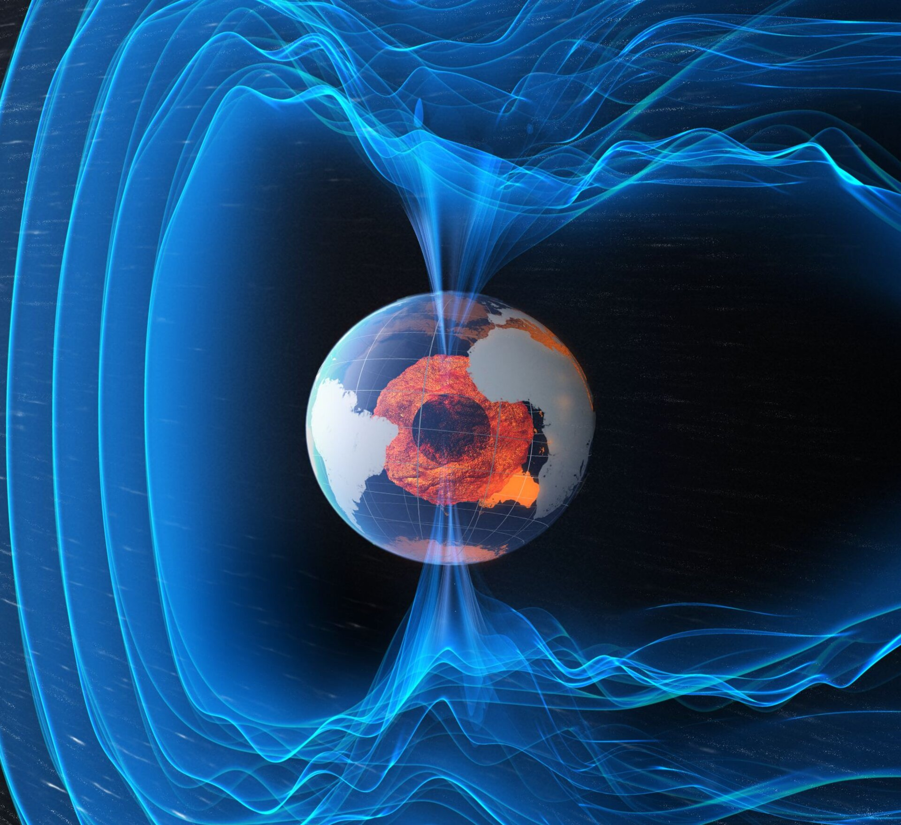

# 中欧联合「微笑」卫星完成发射前准备，4 月 9 日乘织女星-C 火箭升空

**摘要：** 中国科学院与欧洲空间局（ESA）联合研制的太阳风-磁层相互作用全景成像卫星（SMILE，「微笑」卫星）已在法属圭亚那库鲁航天中心完成所有发射前准备工作，包括与织女星-C（Vega-C）运载火箭的星箭对接。发射窗口确定为当地时间 4 月 9 日。这是中国首次与 ESA 开展任务级全方位深度合作的空间科学探测任务，也是中国科学院空间科学（二期）先导专项的收官之作。

*图片来源：ESA*

## 任务亮点

「微笑」卫星将采用软 X 射线成像技术，**首次实现对地球磁层大尺度结构的整体成像**。这一突破性观测手段有望在空间天气预报、磁层物理学基础认知等领域取得一系列科学突破。

目前中欧联合团队正对发射场天气及火箭、卫星的最终技术状态进行密切监视与确认，全力保障如期发射。

## 信息来源（原文）

- [「微笑」卫星完成发射前最后准备 — 国家航天局](https://www.cnsa.gov.cn/n6758823/n6758838/c10736664/content.html)
- [ESA SMILE 任务页面](https://www.esa.int/Science_Exploration/Space_Science/SMILE)
