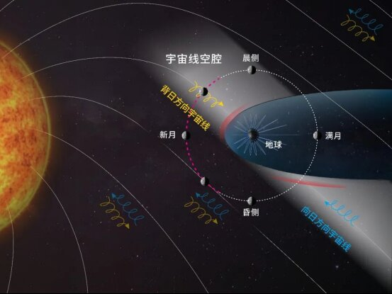

# 嫦娥四号数据发现地月空间"宇宙线空腔"，为深空辐射防护提供新思路

**摘要：** 山东大学史全岐教授研究团队通过分析嫦娥四号着陆器搭载的月表中子与剂量探测仪三年多连续观测数据，首次在月球轨道日侧发现银河宇宙线通量显著降低的空间区域——"宇宙线空腔"。该结构源于地球磁场对银河宇宙线传播路径的调制作用，表明地球磁场的影响范围远超此前认知，可延伸至月球轨道甚至更远区域。这一发现为未来深空探测任务的辐射规避策略与星际航行路径优化提供了重要科学依据。

*图片来源：国家航天局*

## 核心发现

长期以来，科学界认为远离行星磁场的地月空间中银河宇宙线近似均匀分布。然而，研究团队发现：在稳定的行星际磁场和太阳风条件下，月相为12 hM（新月位置）之前的轨道区间内，较低能段（9.18–34.14 MeV）银河宇宙线计数率显著低于其他区域，形成稳定存在的低通量空间结构。

团队随后通过美国月球勘测轨道器（LRO）的探测结果独立交叉验证了该空腔的存在。

## 形成机制

三维粒子轨道数值模拟表明，地球磁场能够显著改变银河宇宙线粒子的传播轨迹，在地月空间特定区域形成稳定的低粒子密度区域。形象而言，地球磁场如同水流中的礁石，改变沿行星际磁场传播的宇宙线粒子流运动，在其背向区域形成"空腔"。

## 意义与展望

- **辐射防护**：该空腔对重离子的屏蔽作用可能更加显著（重离子回旋半径更小，更易被磁场偏转），对降低高危重离子辐射具有重要意义
- **路径优化**：类似的宇宙线空腔可能广泛存在于其他强磁场行星周围，可为星际航行路径规划提供新思路
- **突破认知**：首次证明地球磁场在磁层之外的地月空间尺度仍可调制高能粒子分布

## 信息来源

- [嫦娥四号数据发现地月空间"宇宙线空腔"，或可为星际航行辐射规避提供优化路径 — 国家航天局](https://www.cnsa.gov.cn/n6758823/n6758838/c10737608/content.html)
