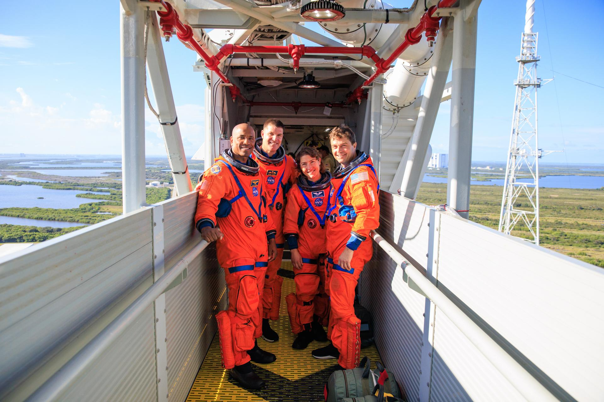

沙特航天局于 4 月 4 日宣布,由沙特自主研制的 **"沙姆斯"(Shams)卫星** 已随 Artemis II 任务成功发射升空,并已建立初步通信链路。这是沙特阿拉伯首个国家级空间天气监测任务。

*Credit: NASA*

## 任务概况

沙姆斯卫星将运行在一条 **近地点 500 公里、远地点 70,000 公里的高椭圆轨道** 上,能够穿越范艾伦辐射带并抵达深空区域,为持续监测太阳活动与空间辐射环境提供理想平台。

该卫星聚焦四大科学领域:

1. **空间辐射环境监测** - 实时测量近地空间及地月空间的辐射强度与分布
2. **太阳 X 射线观测** - 跟踪太阳耀斑活动,为空间天气预报提供关键数据
3. **地球磁场探测** - 研究地磁场变化及其对空间天气的响应
4. **高能太阳粒子监测** - 捕获太阳高能粒子事件,评估对航天器和航天员的潜在威胁

## 意义

沙姆斯卫星的成功发射标志着沙特在太空科学领域迈出了重要一步。作为阿拉伯世界首个专注于空间天气的自主卫星任务,它不仅将服务于本国航天发展,还将为国际空间天气研究网络贡献宝贵数据。

沙特近年来持续加大太空投入,从遥感卫星到载人航天飞行,再到如今的空间天气监测,正逐步构建完整的太空能力体系。

*参考来源:[DoNews](https://www.donews.com/news/detail/8/6499049.html)、[云南网](http://news.yunnan.cn/system/2026/04/05/033951816.shtml)*
