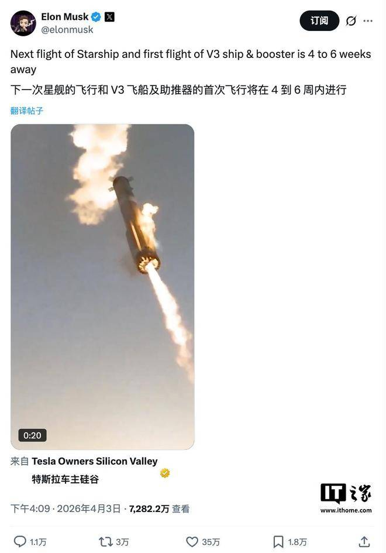

马斯克于 4 月 3 日在 X 平台宣布，**星舰（Starship）V3 的首次飞行将再次推迟 4-6 周**，预计从四月延至五月初。这是该任务第三次推迟：一月时称"6 周内首飞"，三月改为"4 周内"，如今又增加"4-6 周"。

*Credit: SpaceX*

## V3 的重大升级

星舰 V3 相比 V2 进行了数十项技术改进以提升可靠性，主要变化包括：

- **尺寸更大** — V3 比 V2 高约 5 英尺（约 1.5 米）
- **运力跃升** — 近地轨道有效载荷从 V2 的约 35 吨提升至约 **100 吨**，接近翻了三倍
- **猛禽 V3 发动机** — 搭载全新升级的 Raptor V3 引擎，推力和效率均显著提高
- **对接适配器** — 新增在轨推进剂传输所需的对接装置，这是实现登月能力的关键一步

## 背景与影响

星舰上一次飞行还是在 2025 年 10 月，距今已超过半年。NASA 监察长办公室（OIG）报告指出，一次载人登月任务可能需要 **10 次以上** 星舰发射才能完成——包括多次在轨加注。V3 的在轨推进剂传输能力因此备受关注。

频繁的延期虽令外界质疑进度管理，但 SpaceX 一贯以"宁可慢也不炸"的策略确保每次飞行的成功率。V3 作为星舰家族的重大迭代版本，其首飞表现将直接影响 NASA Artemis 登月计划的时间表。

*参考来源：[腾讯新闻](https://new.qq.com/rain/a/20260405A03BR500)、[搜狐](https://www.sohu.com/a/1005395685_122014422)*
