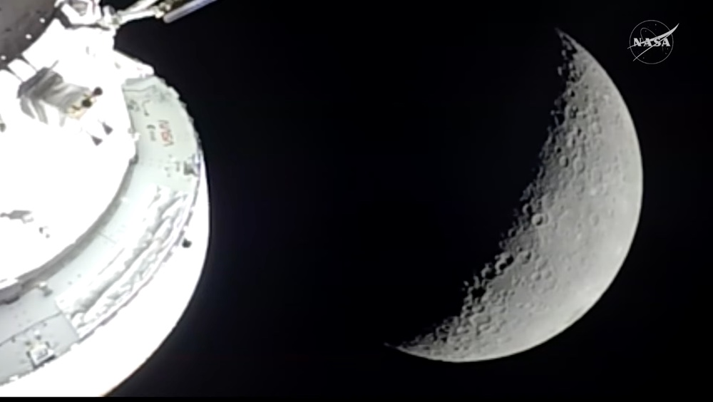

# Artemis II 月球飞越完成：打破 Apollo 13 最远载人航天记录，距地球 406,771 公里

**摘要：** Artemis II 任务迎来历史性时刻——四名航天员成功完成月球飞越，Orion 飞船以距月球表面约 6,500 公里的高度掠过月球背面。飞越期间，Orion 距地球最远达 406,771 公里（252,757 英里），超越 Apollo 13 于 1970 年创下的 400,171 公里（248,655 英里）载人航天最远距离记录。乘组在飞越期间进行了月球表面科学观测和日冕观测，经历了约 40 分钟的计划性通信中断。

*Credit: NASA*

## 打破半世纪记录

4 月 6 日至 7 日，Artemis II 的 Orion 飞船完成了此次任务最关键的里程碑——月球飞越。飞越过程中，Orion 距地球最远达到 406,771 公里，打破了 Apollo 13 乘组于 1970 年 4 月创下的 400,171 公里载人航天最远距离记录。

这一记录已保持了 56 年之久。与 Apollo 13 不同的是，Artemis II 的飞越是计划内的机动操作，而非紧急情况下的意外结果。Apollo 13 之所以超越此前记录，是因为服务舱氧气罐爆炸后飞船被弹射到比预期更远的轨道。

## 飞越细节

Orion 飞船以距月球表面约 6,500 公里（4,066 英里）的最近距离掠过月球背面——远高于 Apollo 任务约 110 公里（70 英里）的近月距离。从这一独特视角，乘组能够同时观察到月球的完整圆盘，包括南北极区域。

飞越持续约 6 小时。当 Orion 经过月球背面时，任务经历了约 40 分钟的计划性通信中断，月球阻挡了深空网络与飞船之间的无线电信号。

## 科学观测

乘组在飞越期间开展了多项科学活动：

- **月球表面观测**：乘组运用此前在地面学习的地质学技能，对撞击坑、远古熔岩流、表面裂缝和山脊进行拍照和描述，记录颜色、亮度和纹理的差异
- **日食与日冕观测**：当 Orion、月球和太阳排成一线时，乘组从太空观测了一次日食——太阳在约一小时内消失在月球背后，乘组得以观测日冕（太阳最外层大气）
- **流星体撞击闪光**：乘组还尝试观测流星体撞击月球表面产生的闪光

## 返程在即

完成月球飞越后，Orion 飞船已启动返回地球的轨道机动。预计乘组将于数日后溅落太平洋，完成为期约 10 天的环月飞行任务。

此次任务的成功标志着自 Apollo 17（1972 年）以来人类首次重返月球附近空域，为后续 Artemis III 载人登月任务奠定了重要基础。

## 信息来源（原文）

- [Artemis II Swings Around the Moon — SpaceNews](https://spacenews.com/artemis-2-swings-around-the-moon/)
- [Artemis II Flight Day 4: Deep-Space Flying, Lunar Flyby Prep — NASA](https://www.nasa.gov/blogs/missions/2026/04/04/artemis-ii-flight-day-4-deep-space-flying-lunar-flyby-prep/)
