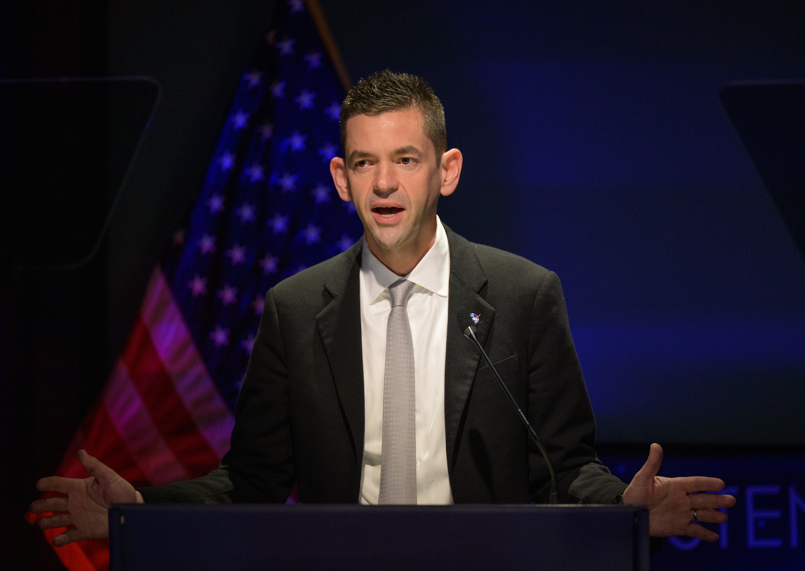

# NASA 局长 Isaacson 为大幅削减预算方案辩护，称将聚焦"大胆目标"

**摘要：** NASA 局长 Jared Isaacman 在国会听证会上为政府提出的 NASA 2027 财年预算案辩护。该预算案提议将 NASA 预算从约 250 亿美元削减至约 200 亿美元，降幅约 20%，其中科学项目受到的削减最为严重。Isaacman 表示 NASA 将"更高效地使用资金"，聚焦于"大胆目标"。

*Credit: NASA/Bill Ingalls*

## 预算削减方案要点

特朗普政府提出的 2027 财年 NASA 预算案主要包括：

- **总预算削减约 20%**：从约 250 亿美元降至约 200 亿美元
- **科学项目受创最重**：地球科学、天体物理学和行星科学项目面临大幅削减
- **Artemis 计划基本保留**：月球探索计划获得相对稳定的资金支持
- **空间站运营调整**：国际空间站的资金结构发生变化

## Isaacman 的辩护

Isaacman 在听证会上表示，NASA 过去多年存在"效率低下"的问题，大量资金被用于管理机构而非直接推进任务。他承诺将通过精简管理、减少冗余项目来实现"用更少的钱做更多的事"。

作为 SpaceX 前私人航天参与者（Inspiration4、Polaris Dawn），Isaacman 强调了商业航天合作的重要性，认为商业能力可以在降低成本的同时加速探索进程。

## 国会反应

两党议员对预算削减表达了不同程度的担忧：

- 民主党议员批评削减幅度过大，认为将严重损害美国的科学领导地位
- 部分共和党议员也对特定项目的削减表示关切，尤其是涉及各自州就业的项目
- 科学界组织纷纷发表声明，警告预算削减将导致任务取消、人才流失和国际合作受损

## 对航天领域的影响

如果预算案最终通过，可能产生以下影响：

- 多个正在开发的科学任务面临延迟或取消
- NASA 中心可能出现大规模裁员
- 与 ESA、JAXA 等国际合作项目的资金分摊受到影响
- 地月空间科学研究能力可能倒退数年

## 信息来源（原文）

- [Isaacman Defends NASA Budget Proposal Despite Steep Cuts — SpaceNews](https://spacenews.com/isaacman-defends-nasa-budget-proposal-despite-steep-cuts/)
