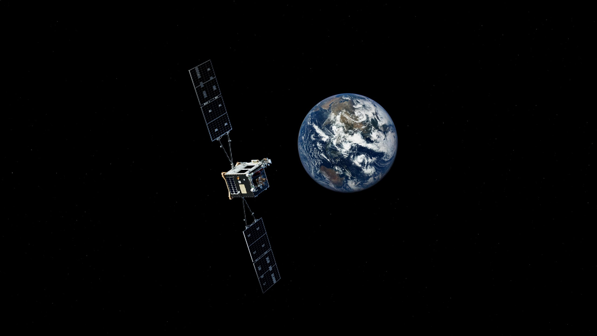

# Starfish Space 获超 1 亿美元融资，推进在轨服务航天器 Otter

**摘要：** 在轨服务初创公司 Starfish Space 宣布完成超过 1 亿美元的新一轮融资。该公司正在开发名为 Otter 的在轨服务航天器，具备卫星延寿、轨道转移和太空碎片清理等能力。新一轮融资将加速 Otter 的开发进程，支持其首次地球静止轨道（GEO）任务。

*Credit: Starfish Space*

## 公司与产品

Starfish Space 是一家专注于在轨服务的航天初创公司，总部位于美国。其核心产品 Otter 是一款小型化、低成本的在轨服务航天器，设计用于：

- **卫星延寿**：为燃料耗尽的卫星提供推进服务，延长其运营寿命
- **轨道转移**：将卫星从低轨转移至目标轨道
- **碎片清理**：移除轨道上的太空碎片，降低碰撞风险

## 融资用途

超过 1 亿美元的新资金将用于：

- 加速 Otter 航天器的工程开发和测试
- 推进 Otter 首次 GEO 任务的准备工作
- 扩大公司团队规模和技术能力

## 在轨服务市场

在轨服务被认为是未来航天产业的关键增长领域。随着地球轨道上的卫星数量急剧增加，对卫星维修、延寿和碎片清理的需求日益迫切。除了 Starfish Space 外，Northrop Grumman 的 MEV（任务延寿飞行器）已在 GEO 执行了多次商业在轨服务任务，Astroscale 也在积极开发碎片清理技术。

## 信息来源（原文）

- [Starfish Space Raises More Than $100 Million — SpaceNews](https://spacenews.com/starfish-space-raises-more-than-100-million/)
