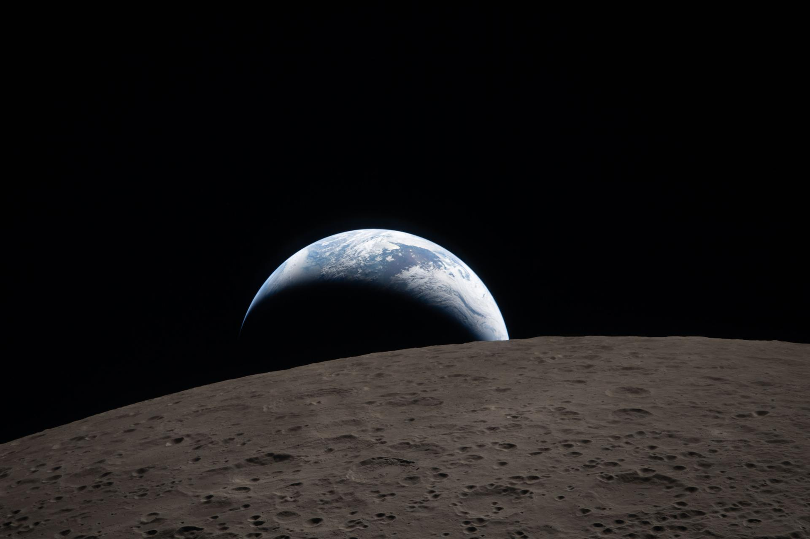

# Artemis II 科学实验全面展开，猎户座飞船开始返航地球

**摘要：** Artemis II 猎户座飞船「Integrity」在完成历史性月球飞越后已进入返航阶段。四名宇航员在 4 月 6 日飞越月球期间拍摄了超过 175 GB 的图像，其中约 50 GB 已通过实验性激光通信载荷传回地球——仅用 45 分钟就传输了 20 GB 数据。NASA 表示，所有月球科学数据将在溅落后 6 个月内公开发布。飞船定于美国东部时间 4 月 10 日晚 8:07 在加利福尼亚州圣地亚哥海岸外溅落。

*Credit: NASA*

## 返航与科学数据

4 月 6 日，Reid Wiseman、Victor Glover、Christina Koch 和 Jeremy Hansen 成为半个多世纪以来首批飞越月球的人类。飞越完成后，飞船执行了一次 15 秒的反应控制系统推进器点火，将速度调整了约 0.5 米/秒，正式开启返航轨道。

科学团队负责人 Kelsey Young 在新闻发布会上表示，在已传回的数千张图像中，"每一张都让我感到惊讶"。除了高分辨率照片，机组还录制了数小时的语音旁白，记录他们对月球表面的实时观测。

## 激光通信突破

猎户座飞船搭载的实验性激光通信载荷展现了巨大潜力：在 45 分钟内成功传回了 20 GB 数据，速度远超传统 S 波段遥测系统。截至发布会时，已有约 50 GB 数据传回地面。

## 卫生间故障仍在排查

此前报道的猎户座飞船卫生间故障（废水管路部分堵塞）仍在持续。工程师已排除结冰原因，目前推测与化学或生物膜碎片堵塞过滤器有关，但不影响任务安全。

## 溅落与数据公开时间表

- **溅落时间**：美国东部时间 4 月 10 日晚 8:07（北京时间 4 月 11 日上午 8:07）
- **溅落地点**：加利福尼亚州圣地亚哥海岸外
- **科学报告**：溅落后 6 个月内发布两份报告——科学团队组织工作报告和初步月球科学报告

*猎户座飞船在月球飞越期间观测到的日食。Credit: NASA*

## 信息来源（原文）

- [Artemis 2 science gets underway as Orion begins its return trip — SpaceNews](https://spacenews.com/artemis-2-science-gets-underway-as-orion-begins-its-return-trip/)
- [NASA's Artemis II Crew Beams Official Moon Flyby Photos to Earth — NASA](https://www.nasa.gov/news/)
- [Twin NASA Control Rooms Support Artemis Safety, Success — NASA](https://www.nasa.gov/news/)
