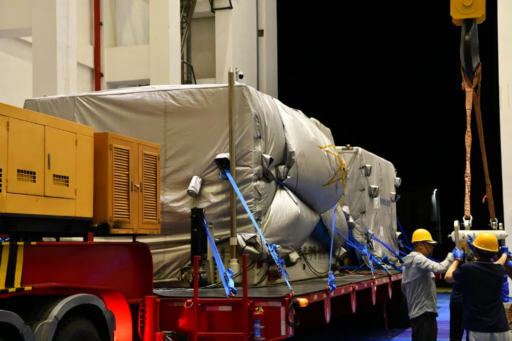

# 嫦娥七号探测器已安全运抵文昌航天发射场，计划今年下半年发射

**摘要：** 新华社海南文昌4月10日电，嫦娥七号探测器已安全运抵中国文昌航天发射场，计划今年下半年择机发射。该任务将突破高精度月面软着陆、腿式行走、月面飞跃和月面永久阴影坑探测等关键技术。

## 信息来源（原文）

- [嫦娥七号探测器计划今年下半年择机发射 已安全运抵中国文昌航天发射场 - 新华社](https://www.news.cn/tech/20260410/b245edd4b7ba4bf0bc3164ffa69af2de/c.html)

> 转载说明：本文转载自新华社，信息来源权威可靠。图片来源为中国载人航天微信公众号。

---

嫦娥七号探测器是中国月球探测工程的重要任务之一，标志着中国深空探测能力的进一步提升。

### 任务核心目标

嫦娥七号任务的目标是突破多项关键技术，包括：

1. **高精度月面软着陆** - 实现精准着陆月球表面
2. **腿式行走** - 探测器在月球表面的移动能力
3. **月面飞跃** - 类似月球车的跳跃式探测
4. **月面永久阴影坑探测** - 探索月球南极永久阴影区域

### 探测方式

任务将采用"绕、落、巡、飞跃"等综合探测方式，对月球南极环境与资源进行详细勘查，并积极开展国际合作，共享科学数据。

### 技术统合

据介绍，为充分发挥新型举国体制优势，中国将对现有载人登月和无人探月领域的资源力量进行深度统合，利用载人航天工程、嫦娥工程几十年积累的技术能力和实践经验，提升中国月球探测的综合效益。

嫦娥七号任务的推进，将为中国未来载人登月和深空探测奠定坚实的技术基础。