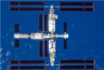

# 中国空间站将迎「二次扩容」，从「T」字形迈向「十」字形

**摘要：** 2026年4月29日是天和核心舱发射入轨五周年。面对空间站任务不断拓展、267项科学实验项目在轨部署的现状，中国空间站将迎来「二次扩容」——在现有「T」字形组合体基础上，于核心舱前向对接口增加一个比天和核心舱规模更大的扩展舱段，形成「十」字形构型。新舱段将提供更多停泊口、增加出舱口，并为后续新实验舱段预留对接口，以满足货运飞船与载人飞船频繁往来需求。

*图片来源：快科技*

## 从「T」到「十」：二次扩容详情

中国空间站目前由天和核心舱、问天实验舱、梦天实验舱组成「T」字形组合体，在轨稳定运行五周年。随着空间站任务持续拓展，科研项目日益增多，现有构型已面临空间不足的问题。

据相关专家透露，空间站二次扩容方案将在**核心舱前向对接口**新增一个扩展舱段，使组合体从「T」字形升级为「十」字形。新舱段规模将比天和核心舱更大，提供以下能力：

- **更多停泊口**：支持更多货运飞船、载人飞船同时停靠
- **增加出舱口**：满足航天员频繁出舱活动需求
- **预留对接口**：为新实验舱段未来接入提供接口

## 长征五号B同步升级

与空间站扩容相配套，长征五号B运载火箭也将进行升级。科研团队将研制更大直径的整流罩，并在现有芯一级基础上再增加一级，以适配未来更大规模舱段的发射需求。

## 多元航天员构成加速形成

除硬件扩容外，空间站人员构成也将更加多元：

- **港澳航天员**：来自港澳地区的航天员有望最早于今年执行空间站飞行任务
- **巴基斯坦航天员**：将有一名巴基斯坦航天员以载荷专家身份执行短期飞行任务
- **联合国外空司合作项目**：持续推进之中

## 巡天空间望远镜即将对接

空间站扩容的另一个重要背景是**巡天空间望远镜**的即将到来。这是中国空间站工程的重要组成部分，将与空间站形成协同观测能力，为中国天文学研究提供强大平台。

## 信息来源（原文）

- [中国空间站面临「空间不足」怎么办？专家透露（搜狐）](https://www.sohu.com/a/1016388601_162758)
- [中国空间站将迎来二次扩容：「T」字变「十」字构型（快科技）](https://news.mydrivers.com/1/1119/1119445.htm)
- [天和核心舱在轨稳定运行五周年 成果一览（我们的太空）](https://www.toutiao.com/article/7634032414745952831/)
