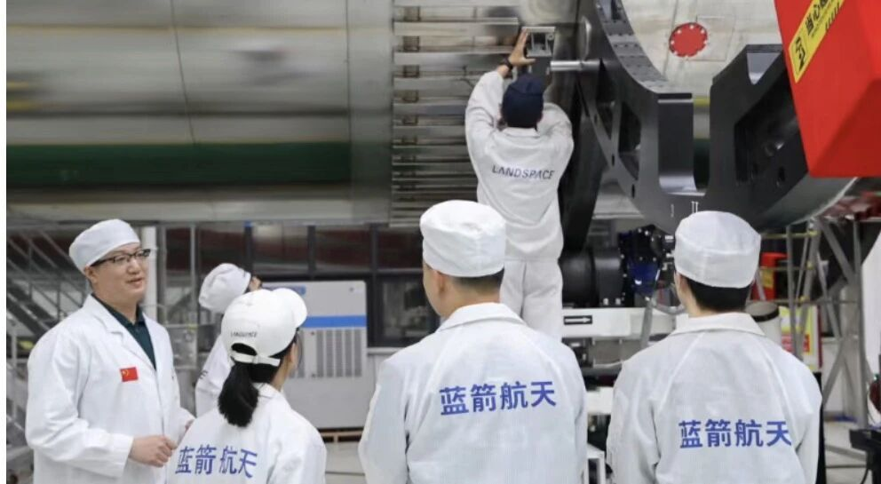

# 蓝箭航天朱雀三号遥二火箭正式进入出厂阶段，稳步冲刺二季度发射

**摘要：** 2026年4月，蓝箭航天朱雀三号遥二运载火箭完成全部归零整改，正式进入出厂阶段，即将奔赴发射场。该箭瞄准二季度再次实施一子级回收复用试验，是朱雀三号可重复使用火箭技术验证的关键一步。此前遥一曾在回收过程中因二次点火故障导致回收未完全成功，遥二将在此基础上进行技术改进与复飞验证。

*图片来源：蓝箭航天*

朱雀三号是蓝箭航天自主研制的可重复使用液氧甲烷运载火箭，直径4.2米，整体采用不锈钢材质，是我国首款不锈钢运载火箭。一子级配置9台天鹊TQ-12B液氧甲烷发动机，二子级配置1台TQ-15B真空发动机。该火箭一次性任务低轨运载能力达21.3吨，航区回收任务运力18.3吨，返场回收任务运力12.5吨，设计重复使用次数目标为20次以上。

2025年12月3日，朱雀三号遥一运载火箭入轨圆满成功，但在一子级垂直回收技术的飞行验证中，火箭一子级在着陆段点火后出现异常，残骸着陆于回收场坪边缘，未能实现软着陆。蓝箭航天技术团队针对遥一飞行中暴露的问题完成了全面归零整改，确保遥二以更可靠的状态重返发射场。

按计划，朱雀三号遥二将在二季度执行一子级全流程轨道级回收冲刺试验，验证垂直起降回收关键技术。若遥二回收试验取得成功，蓝箭航天将在四季度进一步尝试首次回收复用飞行，即火箭一子级回收后经检修可再次执行发射任务，实现真正意义上的可重复使用。

蓝箭航天创始人兼CEO张昌武曾表示，朱雀三号的重复使用技术将为商业航天发射成本带来显著下降，运载价格有望从当前每公斤约6万元降至2万元以下，有力支撑国家卫星互联网工程和重大空间基础设施建设。

## 信息来源（原文）

- [蓝箭航天官微：朱雀三号遥二火箭正式进入出厂阶段](https://so.html5.qq.com/page/real/search_news?docid=70000021_82269f28b4682852)
- [科创板日报：朱雀三号遥二火箭正在进行出厂前准备](https://new.qq.com/rain/a/20260424A02K5W00)
- [界面新闻：蓝箭航天张晓东谈朱雀三号2026年回收计划](https://www.jiemian.com/article/14208628.html)
