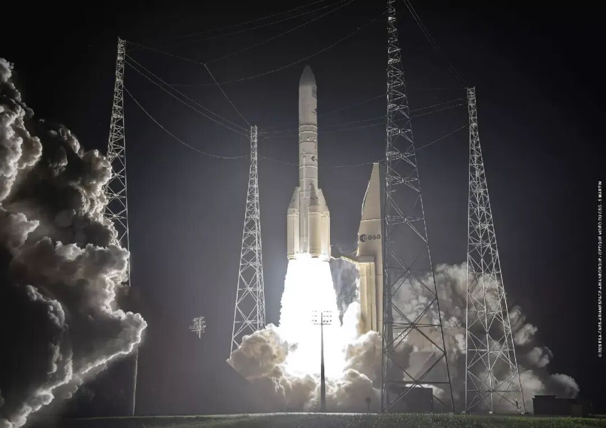

# 阿里安6火箭成功发射亚马逊第二批LEO卫星，3天内完成两次发射

**摘要：** 2026年4月30日，阿里安航天公司在法属圭亚那库鲁欧洲航天港，使用配置最强大的阿里安64型火箭（配备四枚助推器），成功将第二批32颗亚马逊LEO卫星送入约465公里高度的近地轨道。从点火到最后卫星分离，任务总耗时1小时54分钟，全程按计划圆满完成。这是亚马逊LEO星座在3天内的第二次组网发射，4月28日ULA已使用Atlas V火箭发射了首批卫星。

*图片来源：腾讯网 / 阿里安航天*

## 信息来源（原文）

- [3天内亚马逊第二次发射LEO互联网星座（腾讯网）](https://so.html5.qq.com/page/real/search_news?docid=70000021_08669f3e83913552)
- [亚马逊Leo卫星互联网服务将于2026年中正式上线（腾讯网）](https://so.html5.qq.com/page/real/search_news?docid=70000021_12869d8c4e683652)

> 亚马逊LEO星座（Project Kuiper）规划建设3236颗低轨卫星，旨在提供全球宽带互联网服务。2026年4月28日，ULA使用Atlas V火箭成功发射首批27颗Kuiper卫星；仅3天后的4月30日，阿里安6便完成第二次发射，两家发射服务商密集发射体现了亚马逊加速部署星座的紧迫感。
