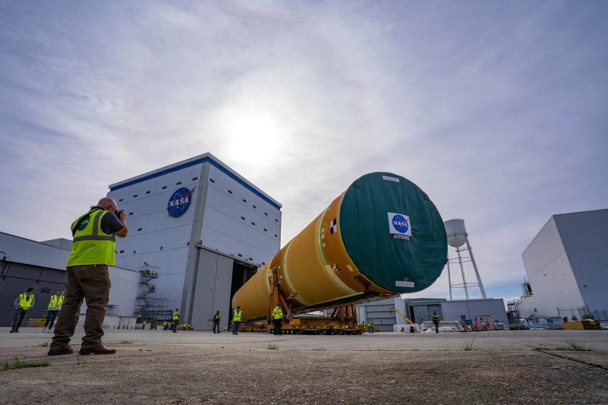

# Artemis III 登月核心级抵达肯尼迪航天中心，SLS 火箭进入总装阶段

**摘要：** 美东时间2026年4月20日，NASA SLS火箭Artemis III任务的核心级（Core Stage）分两阶段成功从Michoud制造设施运抵肯尼迪航天中心（KSC），随后于4月27至28日完成卸载并转运至航天器装配大楼（VAB）。这标志着Artemis III任务火箭总装工作全面启动，载人登月计划进入最后冲刺阶段。

*Credit: NASA / Kennedy Space Center*

 Artemis III 任务核心级运输从4月20日开始，超级孔雀鱼运输机分两阶段将完整火箭芯级从路易斯安那州Michoud制造工厂飞抵佛罗里达州KSC。4月27日，核心级在VAB外完成卸载，随后两天内通过特殊转运车移入装配大楼，即将开始与过渡连接件和发动机航电的集成工作。

根据NASA局长贾里德·艾萨克曼（Jared Isaacman）4月27日在众议院拨款委员会NASA预算听证会上的陈述，SpaceX星舰登月器和蓝色起源蓝月登月器最早都要到2027年底才能完成准备，用于Artemis III任务的地球轨道会合与互操作性测试。这意味着Artemis III的载人登月仍面临时间表调整压力。

Artemis III 将把四名宇航员送入月球轨道，其中两名宇航员将搭乘SpaceX星舰或蓝色起源蓝月着陆器降落在月球南极附近，执行约一周的月面活动后返回猎户座飞船。

## 信息来源（原文）

- [Artemis III Core Stage Arrives at Kennedy（Spaceth.co，2026年4月27日）](https://spaceth.co/sls-core-stage-arrive-ksc/)
- [登月版星舰、蓝月登月器最早2027年底就绪（腾讯新闻，2026年4月28日）](https://so.html5.qq.com/page/real/search_news?docid=70000021_95769f0baad30452)
- [NASA Artemis II Launch Mission Countdown Begins（NASA Blogs，2026年3月30日）](https://www.nasa.gov/blogs/artemis/page/3/)
