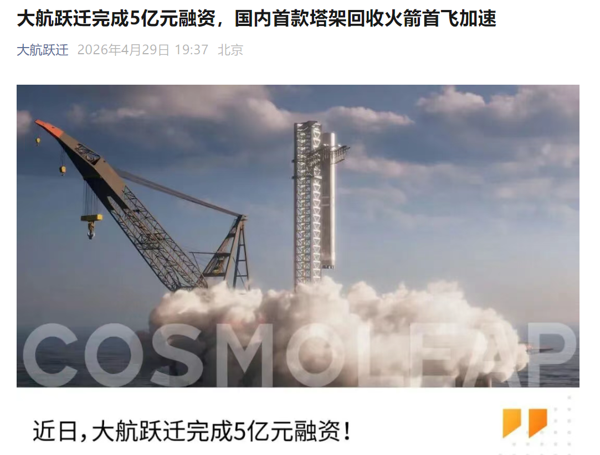

# 大航跃迁完成5亿元融资，加速「跃迁一号」可回收火箭研制

**摘要：** 2026年4月29日，商业航天企业上海大航跃迁航天科技有限公司宣布完成5亿元新一轮融资。本轮融资由前海方舟、厚纪资本、普华资本领投，君领资本、海愿资本等多机构跟投，华兴资本担任长期财务顾问。所募资金将主要用于加速国内首款塔架回收运载火箭「跃迁一号」的研制与首飞，以及百吨级液氧甲烷发动机的研发测试。目前公司首飞箭已全面进入生产试验阶段，计划2026年下半年启动总装总测，2027年完成首飞。

## 信息来源（原文）

- [大航跃迁完成5亿元融资，首飞箭计划下半年启动总装总测（腾讯新闻，2026年5月1日）](https://so.html5.qq.com/page/real/search_news?docid=70000021_22769f306d626052)
- [大航跃迁完成5亿元融资，国内首款塔架回收火箭首飞加速（东方财富网，2026年4月30日）](http://finance.eastmoney.com/a/202604303726049621.html)
- [大航跃迁完成5亿元融资，推进塔架回收火箭研制（经济观察网，2026年4月30日）](http://www.eeo.com.cn/2026/0430/859302.shtml)
