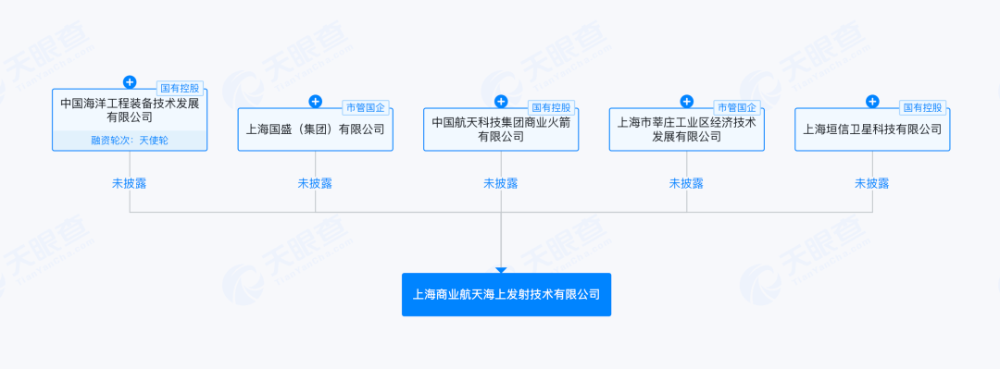

# 五家国央企联合成立海上发射公司，上海商业航天构建全产业链闭环

**摘要：** 2026年4月30日，上海商业航天海上发射技术有限公司正式注册成立，注册资本11亿元，法定代表人为哈尔曼，注册地为上海市闵行区。该公司由五家国央企联合出资组建，分别涉及卫星运营、火箭制造、海上平台、产业基地和国有资本等关键领域。这一举措标志着上海商业航天在海上发射服务这一关键环节实现全产业链闭环。

*图片来源：东方财富网*

上海商业航天海上发射技术有限公司的股东阵容覆盖了商业航天产业链的五大关键维度：

- **上海国盛（集团）有限公司**——国有资本运营平台
- **上海市莘庄工业区经济技术发展有限公司**——产业基地与园区运营
- **上海垣信卫星科技有限公司**——卫星运营与服务
- **中国海洋工程装备技术发展有限公司**——海上工程与发射平台
- **中国航天科技集团商业火箭有限公司**——火箭研发与制造

这一股东结构实现了从卫星运营到火箭制造、从海上平台建设到国有资本支持的完整闭环，体现了上海在商业航天领域构建自主可控产业生态的战略布局。

值得注意的是，2025年4月，上海市经信委等部门联合印发的《上海市关于加快培育商业航天先进制造业集群的若干措施》已明确提出，要拓展陆海联动发射资源，推动海上发射及回收平台装备研制，并研究规划海上移动式专用发射工位。此次海上发射公司的成立，正是对上述政策目标的具体落实。

海上发射相比陆基发射具有多项优势：首先，海上发射平台可灵活选择发射位置，靠近赤道的发射点能利用地球自转速度节省燃料；其次，海上发射对地面人员安全和财产影响较小；再次，海上移动发射平台可根据任务需求灵活调度，提高发射频率。随着国内商业星座建设加速，海上发射能力将成为稀缺的战略资源。

## 信息来源（原文）

- [上海商业航天海上发射公司成立，11亿元注册资本构建全产业链闭环（腾讯新闻，2026年5月1日）](https://new.qq.com/rain/a/20260501A04I0N00)
- [大动作！上海商业航天迈出关键一步（东方财富网，2026年5月1日）](http://finance.eastmoney.com/a/202605013727224653.html)
- [五家国央企联合设立海上发射公司，上海商业航天产业再落关键一子（腾讯网，2026年5月1日）](https://so.html5.qq.com/page/real/search_news?docid=70000021_50369f41d9d49852)

> 上海商业航天产业集群目前已形成从火箭研制、卫星制造到发射服务的完整布局，海上发射公司的成立补齐了最后一块关键拼图，对提升我国商业航天全链条自主可控能力具有重要意义。
