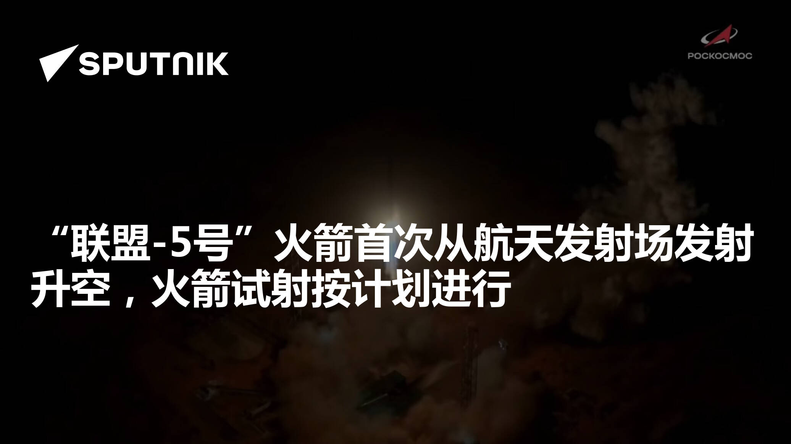

# 俄罗斯「联盟-5号」火箭完成首次发射（测试版本）

**摘要：** 2026年5月1日，俄罗斯国家航天集团公司宣布，「联盟-5号」（Soyuz-5）运载火箭首次从哈萨克斯坦拜科努尔航天发射场的拜捷列克（Baiterek）综合设施发射升空，测试发射按计划进行。「联盟-5号」是俄罗斯研制的新一代中型运载火箭，由俄罗斯能源火箭公司和进步火箭航天中心联合研发，此次首飞标志着该火箭正式进入飞行测试阶段。

*图片来源：俄罗斯卫星通讯社（已获授权转载）*

「联盟-5号」火箭采用两级/三级构型，起飞质量约530吨，长度约61.87米，直径4.1米，以液氧煤油为主要推进剂。该火箭一级采用RD-171MV发动机，这是苏联时期天顶号火箭一级RD-171发动机的升级版本，海平面推力可达740吨，被誉为"沙皇发动机"。二级计划使用RD-0124MS发动机，级间采用"热分离"方式，即二级发动机先点火后再进行分离。

「联盟-5号」近地轨道运力约17.8吨，地球同步转移轨道运力约2.5吨，主要用于恢复俄罗斯中型运载火箭的发射能力，减少对外部技术的依赖。该项目是俄罗斯与哈萨克斯坦联合实施的合作项目，俄罗斯负责火箭研发与制造，哈萨克斯坦负责在拜捷列克综合设施框架内对发射工位进行现代化改造。

此次首次发射为测试版本，火箭从拜捷列克综合设施的专用发射台升空，发射过程按计划进行。后续「联盟-5号」将与俄罗斯另一款中型火箭「联盟-6号」以及重型「安加拉」系列共同构成俄罗斯新一代运载火箭家族。

## 信息来源（原文）

- [「联盟-5号」火箭首次从航天发射场发射升空，火箭试射按计划进行（俄罗斯卫星通讯社，2026年5月1日）](https://sputniknews.cn/20260501/1071052168.html)
