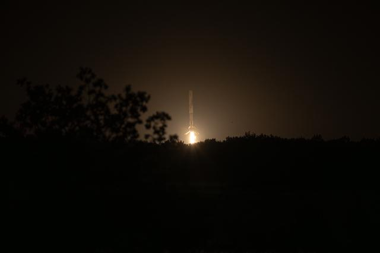

# SpaceX猎鹰火箭完成第600次回收，可重复使用技术进入成熟期

**摘要：** 2026年4月20日，SpaceX使用编号B1097.7的猎鹰9号火箭从范登堡太空军基地发射，将25颗星链卫星送入轨道，并完成第600次轨道级火箭回收。仅一天后的GPS III SV10发射任务又将这一数字刷新至601次。从500次到600次仅用7个月，SpaceX已将火箭回收变为常规操作。

*Credit: NASA*

## 信息来源（原文）

- [SpaceX猎鹰火箭600次回收完成！星链卫星在轨10279颗（DoNews）](https://so.html5.qq.com/page/real/search_news?docid=70000021_34169e84b9693352)
- [SpaceX完成第600次火箭回收，再创航天新纪录（腾讯航天）](https://new.qq.com/rain/a/20260421A07RUY00)
- [SpaceX完成人类航天史上第600次回收：可回收火箭时代的终极验证（今日头条）](https://www.toutiao.com/article/7632564185657917994/)
