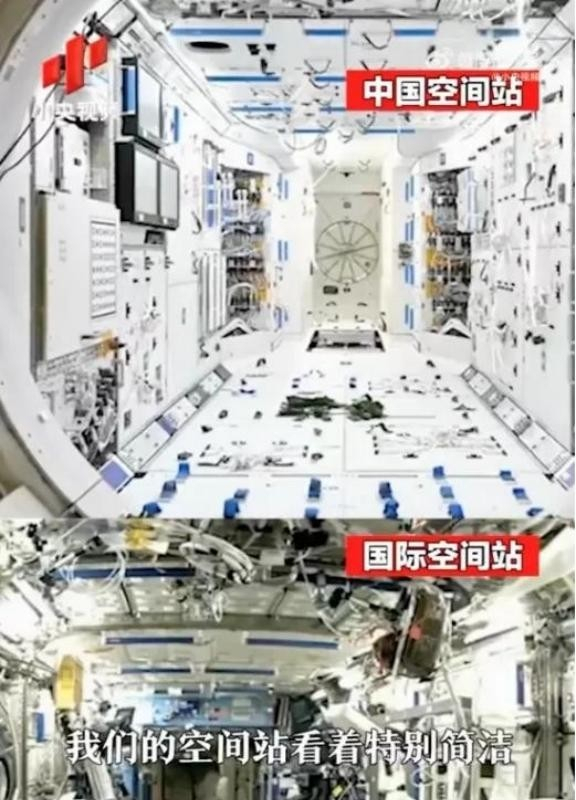

# 天和核心舱在轨五周年 中国空间站启动二次扩容计划

**摘要：** 4月29日是中国空间站天和核心舱发射入轨五周年。五年来，天和核心舱在轨运行稳定、效益发挥良好，已在轨部署和实施267项科学与应用项目。当前空间站组合体为「T」字形，随着在轨科研任务、国际合作项目不断拓展，空间站面临「空间不足」的发展难题据悉，我国空间站未来将正式迎来「二次扩容」，在核心舱前向对接口增加一个新的扩展舱段，形成「十」字形组合体。新扩展舱段比天和核心舱更大，将提供多个新的停泊口，并为航天员增加1个出舱口。后续还将迎来巡天空间望远镜，长征五号-B也将进行升级，研制更大直径整流罩以适配空间站工程。此外，来自港澳的航天员将陆续入驻，1名巴基斯坦航天员将以载荷专家身份执行短期飞行任务。

*图片来源：腾讯新闻*

## 信息来源（原文）

- [央视网：天和核心舱在轨稳定运行五周年 空间站将迎来「二次扩容」](https://tv.cctv.com/2026/04/30/VIDEDoNHOa8JilukCvE6qcuQ260430.shtml)
- [新浪财经：中国空间站将迎来二次扩容](https://finance.sina.com.cn/tech/roll/2026-04-30/doc-inhwewsq7821807.shtml)
- [今日头条：中国空间站迎发射五周年 即将启动二次扩容](https://www.toutiao.com/w/1863842076186634/)
- [腾讯新闻：2026年5月载人航天大事记](https://so.html5.qq.com/page/real/search_news?docid=70000021_90469f41a7123852)
