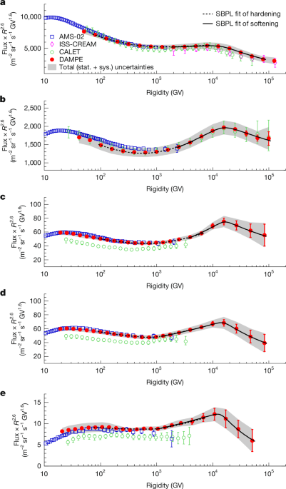

# 「悟空」号揭示宇宙射线加速关键机制

**摘要：** 2026年4月29日，中国科学院紫金山天文台领衔的国际科研团队依托「悟空」号暗物质粒子探测卫星的十年在轨数据，在国际学术期刊《自然》发表重要成果，首次发现宇宙射线加速能量极限存在电荷依赖规律——即加速源对不同电荷数粒子的加速能力存在明确上限。这一发现对揭开宇宙射线起源之谜具有重要意义，标志着中国空间科学探测达到国际领先水平。

*Credit: 紫金山天文台 / Nature*

「悟空」号暗物质粒子探测卫星自2015年12月17日成功发射以来，已在轨平稳运行超过10年，超期服役后仍保持着卓越的科学探测能力。卫星共搭载75916路信号通道，是我国在太空飞行中电子学最复杂的探测器，也是目前世界上观测能段范围最宽、能量分辨率最优的空间探测器。

依托「悟空」号强大的探测能力，科研团队精确测量了质子、氦、碳、氧、铁这5种宇宙射线中最常见粒子的能量分布，首次直接观测到它们在高能段均出现一致的"鼓包"结构。其中，碳、氧、铁三种粒子的最高有效测量能量比以往提升了近10倍。通过进一步研究，团队发现这个特殊"鼓包"出现的位置与粒子的电荷成正比。

结合多项观测数据进行综合分析后，科研团队得出结论：在地球附近存在一个近距离的宇宙射线加速源，粒子能谱上出现的"鼓包"正是该加速源加速能力达到上限的标志。这一发现为宇宙射线加速机制的研究提供了全新的观测证据，对理解宇宙射线的起源和传播机制具有深远影响。

基于「悟空」号积累的成功经验，紫金山天文台联合国内多家单位提出了下一代伽马射线探测项目——甚大面积伽马射线空间望远镜（VLAST），该望远镜预期综合性能将比现有Fermi卫星提升10倍，有望在暗物质探测和宇宙射线研究领域带来新的突破。

## 信息来源（原文）

- [「悟空」号揭示宇宙射线加速关键机制（上海热线，2026年5月1日）](https://news.online.sh.cn/news/gb/content/2026-05/01/content_10447649.htm)
- [新成果！「悟空」号揭示宇宙射线加速关键机制（腾讯新闻，2026年5月1日）](https://new.qq.com/rain/a/20260501A01T5X00)
- [Nature论文：Cosmic-ray acceleration and diffusion beyond the knee](https://www.nature.com/articles/s41586-026-10472-0)
