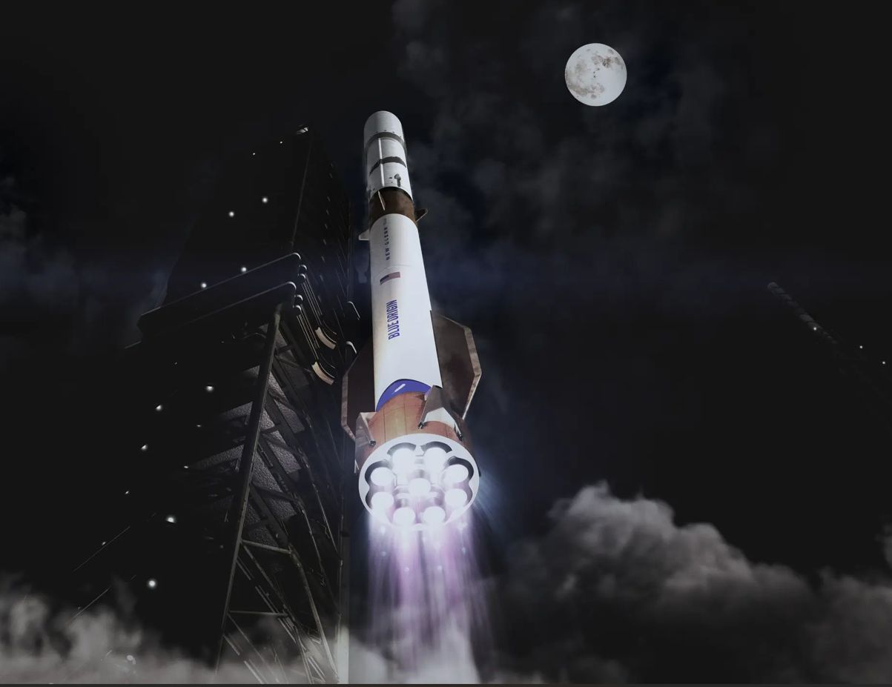

# 蓝色起源启动「新格伦」火箭Quattro第二级升级项目，9x4超级重型构型最快明年亮相

**摘要：** 当地时间2026年5月1日，蓝色起源宣布启动「新格伦」（New Glenn）火箭第二级升级项目「Quattro」，拟将火箭现役「7台BE-4第一级 + 2台BE-3U第二级」的7x2构型，升级为「9台BE-4第一级 + 4台BE-3U第二级」的9x4超级重型布局，显著提升运载能力。公司同时公布野心勃勃的产能爬坡目标，计划2028年实现年产60枚第二级，2029年冲击年产100枚。

*图片来源：蓝色起源（Blue Origin）*

## 信息来源（原文）

- [IT之家：蓝色起源披露「新格伦」火箭升级计划，9台第一级4台第二级引擎](https://www.ithome.com/archives/1644046)
- [DoNews快讯：蓝色起源将升级新格伦火箭为9x4构型，最快明年亮相](https://www.donews.com/news/detail/8/6539558.html)
- [凤凰网：蓝色起源披露新格伦火箭升级计划](https://tech.ifeng.com/c/8slw0uHeRpU)

## 详情

蓝色起源于2026年5月1日（美国时间）通过科技媒体Ars Technica发布博文，宣布启动代号「Quattro」的新格伦火箭第二级升级项目。该公司正在招募一名高级经理，专门负责为四发动机第二级设计制造推进剂贮箱——这是火箭储存低温推进剂的核心部件。

### 从7x2到9x4：超级重型火箭的跨越

新格伦火箭目前采用7台BE-4发动机驱动第一级、2台BE-3U氢氧发动机驱动第二级的「7x2」构型。而Quattro升级项目将把第二级发动机数量从2台倍增至4台，最终形成「9台第一级BE-4 + 4台第二级BE-3U」的9x4构型。

这一升级意味着新格伦将首次跨入全球超级重型火箭行列。据Ars Technica分析，9x4版本的近地轨道运载能力将从此前的约45吨显著提升至70吨以上，与SpaceX的猎鹰重型（Falcon Heavy）及正在研发中的ULA火神-半人马座（Vulcan Centaur）展开正面竞争。

### 产能爬坡：2029年年产100枚第二级

Quattro升级不仅着眼性能提升，更包含极具野心的量产目标。蓝色起源在招聘信息中披露：

- **当前产能**：每年可生产12枚新格伦第二级
- **2028年第三季度目标**：年产60枚
- **2029年目标**：年产100枚

这一产能爬坡节奏意味着蓝色起源正为高频发射任务做大规模工业化准备。考虑到蓝色起源此前已计划2026年进行8至12次新格伦发射，9x4版本若明年如期亮相，将进一步增强其进入国家安全有效载荷和商业载荷市场的竞争力。

### 与SpaceX的竞争态势

在新格伦火箭持续迭代的同时，蓝色起源的竞争对手SpaceX正在推进星舰（Starship）项目，预计2026年下半年执行首次火星无人任务，2027年推出Starlink V3卫星系统。9x4版新格伦的出现将使两家公司在重型运载火箭领域的竞争进一步加剧。
