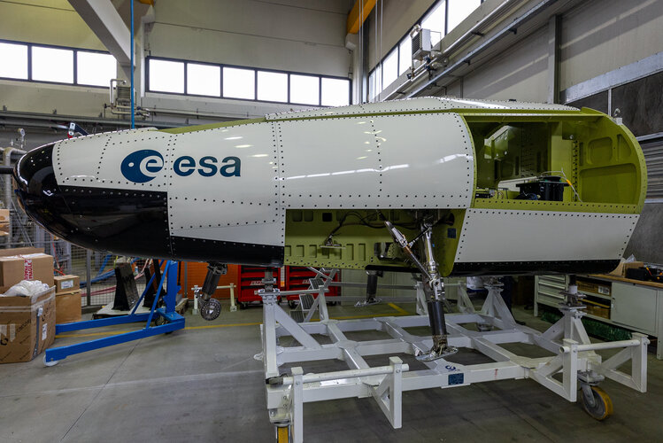

# ESA太空骑行器全尺寸试验模型完成组装

**摘要：** 欧洲航天局于2026年4月23日宣布，Space Rider可重复使用太空运输系统的首个全尺寸试验模型已完成组装。这是一款约两辆小型货车大小的无人机器人实验室，由ESA委托意大利阿丽亚娜集团研制，设计由织女星-C（Vega-C）火箭发射入轨后在轨停留约两个月，届时将执行返回地球的受控再入与着陆。

*图片来源：ESA（已获授权使用）*

Space Rider是欧洲首个可重复使用的太空运输系统，由ESA委托意大利阿丽亚娜集团（ArianeGroup）主导研制。2026年4月23日，ESA宣布该项目的首个全尺寸试验模型完成组装，这标志着欧洲向拥有自主可控的可复用太空货运能力迈出了关键一步。

根据ESA公布的信息，Space Rider尺寸约相当于两辆小型货车，总重数吨，设计由织女星-C（Vega-C）运载火箭从法属圭亚那库鲁发射场发射。发射入轨后，太空骑行器将在低地球轨道停留约两个月，执行预定的机器人实验和技术试验任务。任务期结束后，它将执行受控再入返回地球，着陆于指定地点，实现硬件的回收与重复使用。

Space Rider项目的目标是成为欧洲独立进入太空并返回地面的重要手段，服务于欧洲科学、工业与商业需求。作为织女星-C火箭的"乘客"，它将为欧洲提供一个自主的、可靠的、可重复使用的近地轨道运输与实验平台，减少对外部供应商的依赖。

ESA表示，Space Rider计划在未来几年内完成飞行验证，逐步投入商业运营。欧洲的可复用太空能力将填补Ariane 6火箭在货运返回方面的空白，与美国SpaceX龙飞船和中国多型货运飞船形成竞争态势。

## 信息来源（原文）

- [ESA Space Rider官方页面](https://www.esa.int/Enabling_Support/Space_Transportation/Space_Rider)
- [SpaceWeekly报道：First full-size Space Rider test model assembled（2026年4月23日）](http://spaceweekly.com/)
