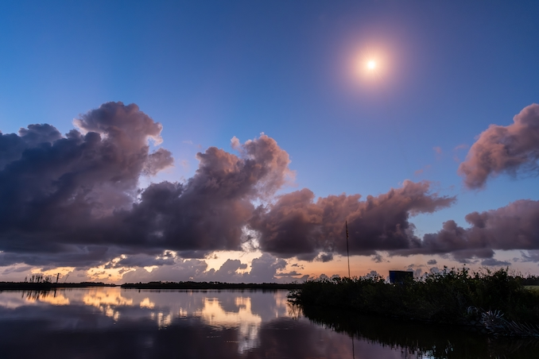

# SpaceX卡纳维拉尔角清晨发射第10-31批29颗Starlink卫星

**摘要：** 2026年5月21日（美东夏令时），SpaceX在卡纳维拉尔角太空军基地成功发射第10-31批29颗Starlink V2 Mini优化版卫星。火箭在日出前约20分钟升空，晨光照射下的火箭尾焰形成壮观的「水母效应」。这是SpaceX 2026年第46次Starlink任务，也是范登堡和卡纳维拉尔双基地同日两次发射的重要组成部分。

## 任务概况

- **发射时间**：2026年5月21日 06:04 EDT（10:04 UTC）
- **发射地点**：卡纳维拉尔角太空军基地40号发射复合体（SLC-40）
- **载荷**：29颗Starlink V2 Mini优化版卫星
- **任务编号**：Starlink 10-31
- **助推器**：猎鹰9号（具体编号待确认）
- **回收平台**：无人机船（具体编号待确认）
- **轨道**：低地轨道（LEO）

火箭以东北方向飞行，升空后不久有效载荷整流罩分离，形成独特的「水母效应」，在美国东海岸可见这一壮观景象。

## 天气与发射窗口

第45气象中队预报发射时有利天气条件概率为90%。气象官员表示，主要关注的是来自巴哈马群岛上空的缓慢移动扰动系统，可能在清晨产生对流云，是发射窗口的主要风险因素。

## 任务背景

本次任务是SpaceX 2026年第46次Starlink组网发射，星座在轨卫星数量已超过10000颗。就在同一天早些时候，SpaceX还从范登堡太空军基地完成了第17-42批24颗Starlink卫星的发射任务，使当日总发射卫星数达到53颗。

## 信息来源（原文）

- [Spaceflight Now: SpaceX's sunrise Starlink launch adds 29 satellites to low Earth orbit megaconstellation](https://spaceflightnow.com/2026/05/20/live-coverage-spacex-to-launch-29-starlink-satellites-on-falcon-9-rocket-from-cape-canaveral-13/)
