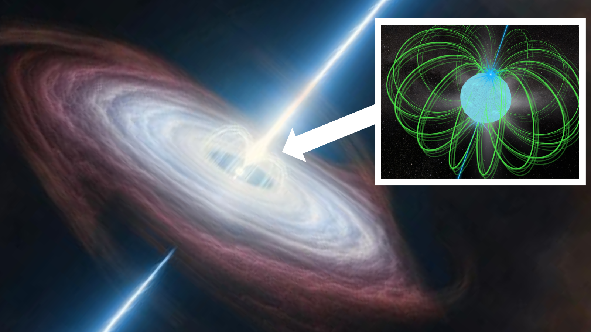
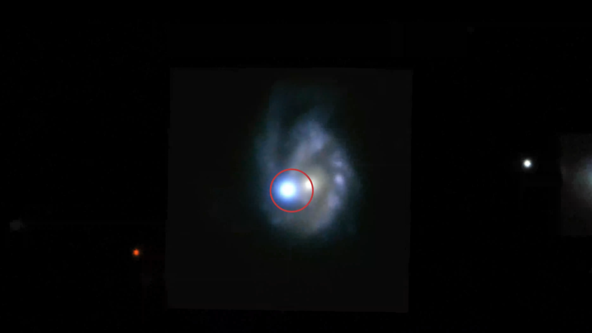

# 科学家首次探测到超亮超新星发射的伽马射线：来自磁陀星供能

**摘要：** 2026 年 5 月 25 日，国际天文学家团队发表论文，宣布首次利用 NASA 费米伽马射线太空望远镜在超亮超新星 SN 2017egm 中探测到明确的伽马射线信号。这一发现证实了该超亮超新星的异常亮度来源于其坍缩后形成的高速旋转磁陀星（magnetar）产生的星风星云（magnetar wind nebula），为超亮超新星的供能机制提供了直接观测证据。

## 发现概述

在包括超新星在内的核坍缩超新星事件中，质量约为太阳 1 至 2 倍的恒星核坍缩至半径约 20 公里，形成中子星。在某些情况下，这些中子星会诞生为高速旋转且拥有极强磁场的中子星——磁陀星。

近二十年来，天文学家一直在费米伽马射线太空望远镜的海量数据中搜索数千颗超新星的伽马射线信号，此前虽有零星线索，但均未得到确认。2024 年，团队宣布首次利用费米望远镜在 SN 2017egm 超亮超新星中成功探测到伽马射线，成为首个获得确认的此类信号。

## 磁陀星供能机制

超亮超新星（superluminous supernova）比普通超新星亮度高 10 至 100 倍，其能量来源长期困扰学界。一种理论认为，这些事件的额外能量来源于其诞生的磁陀星。

研究团队观测了 SN 2017egm 释放的光学和伽马射线辐射，并与光流理论模型进行了比较。结果表明：磁陀星在超新星爆发后快速旋转，将其能量注入周围的超新星遗迹，形成磁陀星星风星云；这个星云反过来加速粒子，产生伽马射线。

## 关键时间线

论文作者 Guillem Martí-Devesa（巴塞罗那太空科学研究所）表示：「超新星残骸在爆发后约三个月逐渐膨胀并冷却，伽马射线开始从磁陀星星风星云中泄漏出来。磁陀星模型最能重现超新星的光度曲线和伽马射线辐射。」

这一发现为超亮超新星的研究开辟了新窗口，证明了利用伽马射线望远镜探测这类事件的可能性，也进一步确认了磁陀星是超亮超新星供能的核心来源。

## 信息来源（原文）

- [Space.com: Scientists just found a supercharged supernova powered up by a magnetic star corpse](https://www.space.com/astronomy/stars/scientists-just-found-a-supercharged-supernova-powered-up-by-a-magnetic-star-corpse)
