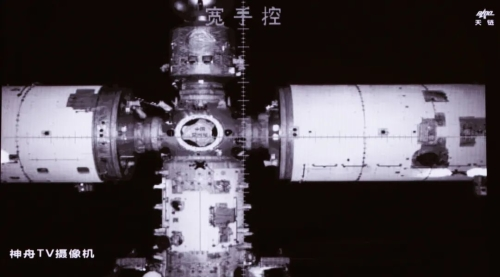
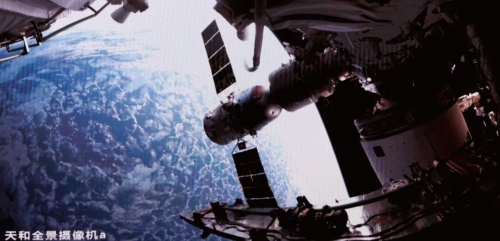

# 神舟二十三号载人飞船与空间站组合体完成自主快速交会对接

**摘要：** 2026年5月25日，神舟二十三号载人飞船在发射后约6.5小时，成功对接于天宫空间站天和核心舱径向端口。神舟二十三号航天员乘组（指令长朱杨柱、航天驾驶员张志远、载荷专家黎家盈）随后依次进入空间站，与正在值守的神舟二十一号航天员乘组实现太空会师。

神舟二十三号载人飞船于5月24日23时08分（北京时间）从酒泉卫星发射中心发射升空后，经过6次轨道机动，于5月25日11时左右完成与天宫空间站的自主快速交会对接。

对接完成后，三名航天员依次打开舱门，正式进驻天宫空间站。神舟二十一号航天员乘组已做好迎接神舟二十三号航天员乘组进驻的各项准备工作，两组航天员将在空间站完成在轨交接。

此次任务是神舟飞船首次采用6.5小时快速交会对接模式，此前神舟飞船对接空间站通常需要约2天时间。快速交会对接大幅缩短了航天员在飞船内的等候时间，提升了载人航天的舒适度和效率。

神舟二十三号乘组将在天宫空间站执行为期约一年的长期驻留任务，期间将开展空间科学实验、技术试验和出舱活动。乘组中的黎家盈来自中国香港，是中国首位进入太空的香港航天员。

## 信息来源（原文）

- [中国载人航天网 - 神舟二十三号载人飞船与空间站组合体完成自主快速交会对接](http://www.cmse.gov.cn/xwzx/202605/t20260525_57566.html)
- [Space.com - China launches 3 astronauts, including 1st ever from Hong Kong, to Tiangong space station](https://www.space.com/space-exploration/human-spaceflight/china-shenzhou-23-astronaut-launch-tiangong-space-station)
