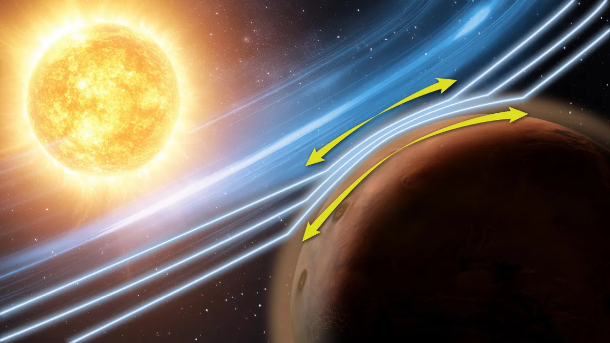

# NASA火星探测器MAVEN数据揭示「Zwan-Wolf效应」：无磁场行星如何抵御太阳风

**摘要：** NASA火星大气与挥发物演化任务（MAVEN）在2014年至2025年间持续观测火星大气。失联前的最后一批科学数据揭示了太阳风与火星大气之间一种全新物理机制——Zwan-Wolf效应。这一发现或能解释无全球磁场保护的天体如何应对恒星粒子的持续撞击，并对研究金星、土卫六等大气演化具有重要参考价值。

## 信息来源（原文）

- [Space.com: 'Very interesting wiggles' in data from silent NASA Mars spacecraft lead to unexpected solar wind discovery](https://www.space.com/astronomy/mars/very-interesting-wiggles-in-data-from-silent-nasa-mars-spacecraft-lead-to-unexpected-solar-wind-discovery)
- [Nature Communications论文 (2026年5月18日)](https://www.nature.com/ncomms/)
- [NASA MAVEN任务主页](https://www.nasa.gov/mission_pages/maven/main/index.html)

NASA的MAVEN探测器在火星轨道上工作想象图。Zwan-Wolf效应揭示了太阳风粒子如何沿临时磁场结构与火星大气相互作用。（来源：Space.com / LASP/CU Boulder）
