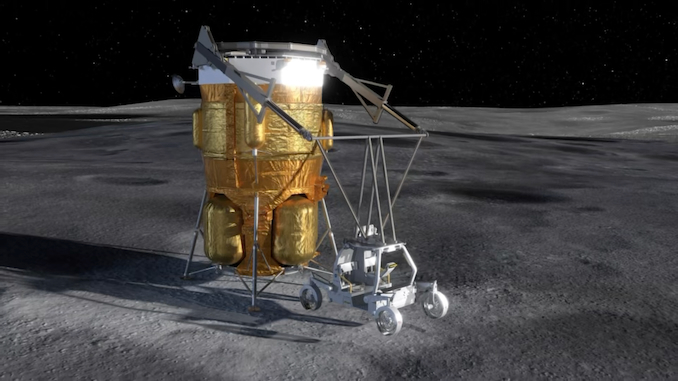

# NASA公布近10亿美元月球基地合同：Blue Origin获2.34亿美元LTV运输合同

**摘要：** 美国国家航空航天局（NASA）于2026年5月26日公布了月球基地建设规划的重大合同授出计划，宣布总额近10亿美元的一揽子投资。NASA授予Astrolab和Lunar Outpost各约2.2亿美元用于完成月球地形车（LTV）设计并将其送达月球表面，同时授予Blue Origin约2.34亿美元用于以Blue Moon Mark 1着陆器运送LTV。根据规划，月球基地将覆盖月球南极「数百平方英里」区域，计划2032年前实现半永久性载人驻留。

## 信息来源（原文）

- [Spaceflight Now — NASA outlines nearly $1 billion investment into initial Moon Base missions](https://spaceflightnow.com/2026/05/27/nasa-outlines-nearly-1-billion-investment-into-initial-moon-base-missions/)
- [Space.com — Artemis moon base will cover 'hundreds of square miles' with hopping drones and new lunar rovers, NASA says](https://www.space.com/astronomy/moon/artemis-moon-base-will-cover-hundreds-of-square-miles-with-hopping-drones-and-new-lunar-rovers-nasa-says)

*Blue Origin Blue Moon Mark 1着陆器概念图 | 图片来源：Spaceflight Now*

*Firefly Elytra Dark探测器部署示意图 | 图片来源：Spaceflight Now*
