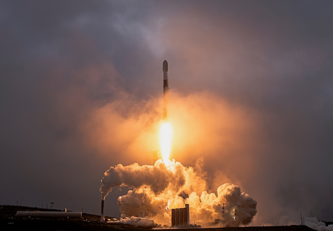

# SpaceX猎鹰九号从范登堡发射24颗Starlink卫星，助推器成功着陆无人船

**摘要：** 2026年5月26日，SpaceX在范登堡空军基地使用猎鹰九号运载火箭成功将24颗Starlink 17-37卫星送入轨道。火箭于当地时间上午7:50:34（太平洋时间）点火起飞，助推器B1100在发射约8.5分钟后成功着陆于太平洋上的无人机船"Of Course I Still Love You"。这是SpaceX第615次助推器回收，也是该无人机船第198次回收。

## 信息来源（原文）

- [Spaceflight Now: SpaceX launches 24 Starlink satellites on Falcon 9 rocket from Vandenberg SFB](https://spaceflightnow.com/2026/05/26/live-coverage-spacex-to-launch-24-starlink-satellites-on-falcon-9-rocket-from-vandenberg-sfb-8/)
