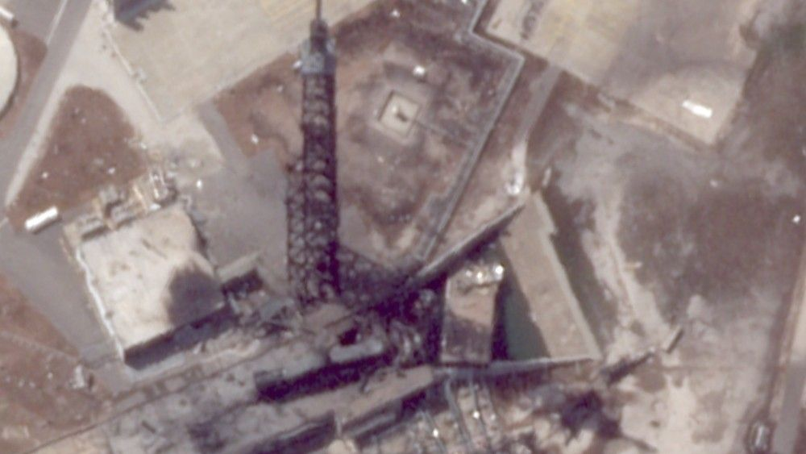

# 从太空看新格伦爆炸：Planet Labs 卫星影像显示 LC-36 发射台被严重烧灼，Bezos 携 Isaacman 现场视察后誓言「Gradatim Ferociter」

**摘要：** 5 月 28 日蓝色起源新格伦（New Glenn）火箭在卡纳维拉尔角 LC-36 发射台静态点火测试中爆炸、箭体全毁、发射台严重受损。事故发生 4 天后，商业遥感卫星运营商 Planet Labs 的 SkySat-C9 卫星于 5 月 31 日飞越卡纳维拉尔角上空，由商业航天影像公司 Spacefromspace 处理回传的高分辨率影像清晰显示 LC-36 区域仍留有明显的烧灼痕迹，印证了地面报道的爆炸猛烈程度。space.com 于 6 月 1 日报道了这一「太空视角的爆炸」；同周内，蓝色起源 CEO Dave Limp 5 月 31 日在 X 平台发文「我们很快会开始清理发射台，并拿出一份完整的重建方案」，创始人 Jeff Bezos 与 NASA 局长 Jared Isaacman 也于 5 月 30 日共同视察了 LC-36 现场，Bezos 在 X 上以蓝色起源标志性口号「Gradatim Ferociter」（拉丁语「稳步前进，勇猛精进」）誓言「我们会重返飞行、登上月球」。

## Planet Labs SkySat-C9 的太空视角

新格伦的爆炸威力之大，连距地面 600 公里轨道上的商业卫星都能看到 LC-36 留下的伤痕。Planet Labs 的 SkySat-C9 是一颗 2016 年发射的亚米级商业对地观测卫星，可在 450 公里轨道上以约 50 厘米分辨率拍摄地面目标。Spacefromspace 在取得 5 月 31 日 SkySat-C9 飞越卡纳维拉尔角的原始数据后，对 LC-36 区域进行了增强处理，使爆炸区域与周围植被的差异清晰可辨。

从空间尺度上看，这次爆炸的痕迹并不局限于 LC-36 自身的发射台，邻近的配套设施也明显受到影响。space.com 报道指出，影像显示 LC-36 周边地面、避雷塔残骸区域以及附近的服务塔基座均出现烧蚀或结构性破坏，与现场人员此前的描述一致。蓝色起源此前公布的照片显示，爆炸中倒塌的避雷塔以及严重受损的脐带塔已被爆炸冲击波扭曲，但地面视角难以全面呈现破坏范围，卫星影像恰好弥补了这一缺口。

这是商业遥感卫星被常态化用于跟踪重大航天事故现场的最新案例。Planet Labs 旗下在轨的 SkySat 星座（21 颗卫星）可实现对全球任意地点的日级重访，SpaceX 火箭试飞、火箭着陆失败、地面爆炸等事件在历史上都曾被 SkySat 完整记录。

## Bezos 携 NASA 局长现场视察

在卫星影像公开的同一天内，蓝色起源与 NASA 的最高决策层也在事故现场出现。5 月 30 日，蓝色起源创始人 Jeff Bezos 与 NASA 局长 Jared Isaacman 共同视察了 LC-36 爆炸现场，这是事故发生后两人首次同时出现在公开记录中。Isaacman 随后在 X 上发文感谢 Bezos 的接待，并承诺 NASA 将在事故调查中提供「全力支持」。

视察结束后，Bezos 在 X 上以一句话表达了自己的态度——「谢谢你们今天到场。我们会重返飞行，我们会登上月球。Gradatim Ferociter.」这是蓝色起源公司拉丁语口号「Gradatim Ferociter」（稳步前进，勇猛精进）首次在重大事故善后阶段被正式引用，传递出公司不会因 NG-4 爆炸而动摇月球计划长期承诺的信号。

蓝色起源 CEO Dave Limp 则于次日（5 月 31 日）在 X 上给出了更具体的工程表态——「我们将很快开始清理发射台，并拿出一份完整的重建方案。」这是蓝色起源在事故善后中首次明确给出「重建」而非「修复」措辞，意味着 LC-36 的损伤程度已经超过了「局部修补」的范畴。但 Limp 仍未公开具体的修复时间表与预算估算，FAA 的事故调查与许可证状态调整仍在进行中。

## 两次历史事故的复飞参考

新格伦 LC-36 的修复周期在历史上并非没有参考。space.com 在同篇报道中列举了两次商业航天史上与新格伦 NG-4 模式类似的「地面静态点火或燃料测试爆炸」事故：

- **Antares 2014 年 10 月 28 日爆炸**：轨道科学公司（OSC，后并入诺格）Antares 火箭在 NASA 瓦洛普斯飞行中心 0B 号工位进行 Antares-130 静态点火测试时，发动机爆炸导致箭体与发射台全毁、附近设施受损严重。修复耗时接近**两年**——直到 2016 年 10 月该工位才再次承担发射任务。

- **SpaceX 2016 年 9 月 1 日猎鹰 9 爆炸**：SpaceX 在卡纳维拉尔角 LC-40 进行 AMOS-6 任务前的静态点火测试时，猎鹰 9 上面级液氧罐内的氦罐发生分层爆炸，箭体全毁、LC-40 严重损坏。SpaceX 凭借肯尼迪航天中心 LC-39A（彼时已基本完成改装）作为备用工位，**约一年后**（2017 年 9 月）重新从 LC-40 恢复发射。

两次事故的复飞周期均以「年」计。蓝色起源目前**仅拥有 LC-36 一个能够支持新格伦这一尺寸火箭的发射工位**——卡纳维拉尔角的 LC-11 虽归蓝色起源所有、但目前仅支持较小的新谢泼德（New Shepard）亚轨道火箭复用——这意味着在 LC-36 完成重建前，新格伦的整个飞行节奏（包括为亚马逊 Leo 商业星座、NASA 月球基地 1 号货物 Blue Moon MK1 与后续载人型 Blue Moon MK2）都将被冻结。这一结构性问题正是 6 月 1 日 space.com 早先发布的行业分析师 Casey Curlee 评论所担忧的核心：「这并不意味着美国失去了月球，但 NASA 必须大幅调整阿尔忒弥斯与月球基地计划以适应这一现实。」

## 当前状态

截至 6 月 1 日，蓝色起源仍未公布 LC-36 重建的正式时间表，FAA 也在继续对事故原因进行调查。公司 5 月 28 日爆炸后被无限期搁置的 NG-4 任务（搭载 48 颗亚马逊 Leo 互联网卫星、有效载荷在事故前完整保存）在新建发射台就位前无法重新排期。原计划 2026 年秋季由新格伦首飞的 Blue Moon MK1 无人月球着陆器，及其后续的 Blue Moon MK2 载人型登月任务，都将根据 LC-36 重建进度重新调整。

## 信息来源（原文）

- [Rocket goes boom, satellite cameras zoom: Explosive Blue Origin damage is visible from space（space.com 2026-06-01）](https://www.space.com/space-exploration/launches-spacecraft/rocket-goes-boom-satellite-cameras-zoom-explosive-blue-origin-damage-is-visible-from-space)
- [新格伦爆炸对 NASA 月球计划意味着什么：行业分析师称其为「重大挫折」，Blue Moon 任务链承压（地月空间入门指南 2026-06-01）](./2026-06-01-blue-origin-ng4-nasa-artemis-impact/)
