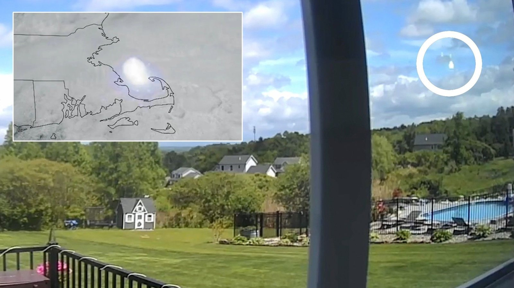

# 美国东北部 5 月 30 日巨响系流星爆炸：NASA 估计能量约 300 吨 TNT 当量

**摘要：** 5 月 30 日下午美国东部时间 2 时 06 分，新英格兰多州居民报告听到一声巨响，并感受到房屋晃动。NASA 6 月 1 日结合目击者报告与 GOES-19 气象卫星影像确认这是一颗在麻州东北、新罕布什尔东南上空约 40 英里（64 公里）高度解体的高空火流星，释放能量约相当于 300 吨 TNT，碎片落入马萨诸塞州鳕鱼湾。

## 一声巨响背后的双重证据

声音从麻州东部一路传到新罕布什尔、纽约上州、康涅狄格和罗德岛。当地居民在社交平台描述「像雷声但天空晴朗」、「房子在抖」。美国流星协会（AMS）很快在「事件 #3867-2026」中收到数百份目击报告。NASA 喷气推进实验室流星环境办公室据此调取 NOAA GOES-19 静止气象卫星上的「地闪测绘仪」（GLM, Geostationary Lightning Mapper）影像，确认事件在 5 月 30 日当地时间下午 2 时 06 分发生。

NASA 官员 5 月 31 日在 X 平台发文说明：「流星似乎在麻州东北、新罕布什尔东南上空约 40 英里高度解体，解体时释放的能量估计相当于 300 吨 TNT，这足以解释那阵巨响。」随后 NASA 阿波罗样品研究室补充，碎片应当落入了鳕鱼湾（Cape Cod Bay），「以严肃的科学术语讲，这叫『鱼碾机』。」

## 地面雷达与卫星联合测绘

NEXRAD 多普勒雷达网络进一步提供了轨道佐证：波士顿 KBOX、波士顿洛根国际机场 TBOS、长岛 KOKX、奥尔巴尼 KENX 四部雷达均捕获到流星回波信号，缅因州波特兰 KGYX 也疑似接收到一段回波。CIRA（科罗拉多州立大学大气研究合作研究所）同步在 X 发布 GOES-19 影像，称「GLM 仪器检测到这枚白昼火流星爆炸瞬间的闪光」。

由于整个事件发生在白天且发生在大气高层，目击者不会看到「流星轨迹」而只会听到音爆。NASA 强调此次事件与正在活跃的任何流星雨无关——5 月 30 日并不是宝瓶座 η 流星雨或水瓶座 δ 流星雨的极大期附近，纯粹是偶发火流星（sporadic bolide）。

## 一次普通却难得的「白昼火流星」

按 NASA 的定义，「bolide」（火流星）通常指亮度足以产生音爆的明亮流星，每年进入地球大气层的较大天体有相当数量，但绝大多数发生在海洋、人烟稀少地区或夜间。白昼事件能被卫星与气象雷达同时记录到的案例极少——上一次能引起美国东北部广泛关注的类似事件，要追溯到 2023 年 2 月俄亥俄上空由 100 公斤级小行星引发的火流星。

NASA 在文中以轻松笔触写道：「虽然所有陨石都落入了水中，但坠落点水深只有 34 米（约 100 英尺），大多数陨石会被磁铁强烈吸引，理论上用一条 100 英尺长的绳子从船上垂下去就能触及——以防有谁对这种冷知识感兴趣。」

事件未造成人员伤亡或财产损失，但提醒人们：低概率的近地小天体事件随时可能在地球任意地点发生。NASA 与美国太空军正在合作建设下一代近地天体监测体系，包括近地天体侦察卫星（NEO Surveyer）与地面雷达网络。

## 信息来源（原文）

- [Massive boom over northeastern US was a meteor explosion as powerful as 300 tons of TNT, NASA confirms — Space.com](https://www.space.com/stargazing/meteor-showers/massive-boom-over-northeastern-us-was-a-meteor-explosion-as-powerful-as-300-tons-of-tnt-nasa-confirms)
- [AMS event #3867-2026 — American Meteor Society](https://www.amsmeteors.org/)
- [CIRA / NOAA GOES-19 GLM 影像（X 帖文）](https://x.com/CIRA_CSU)
