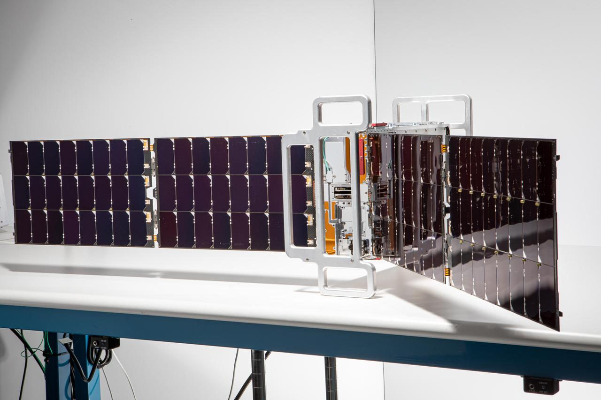

# 北京经开区召开太空算力企业座谈会：京东方、银河航天、蓝箭航天等共推太空算力创新中心落地

**摘要：** 2026年6月3日，北京经济技术开发区召开太空算力企业座谈会，召集京东方、银河航天、蓝箭航天、星河动力、观宇芯算、长鑫集电等太空算力产业链头部企业代表，共商北京太空算力创新中心下一步建设路径。会议明确，太空算力是商业航天与数字经济融合发展的新赛道，已成为全球科技竞争的新前沿；北京经开区近日发起成立的北京太空智算研究院，是高水平建设北京太空算力创新中心的「关键落子」。商业航天板块当日反应迅速——中国卫星盘中涨超8%，信维通信、上海瀚讯、电科蓝天、西部材料跟涨。

## 一场座谈会与一份研究院

北京经开区 6 月 3 日的座谈会紧接 5 月 31 日新华社经济参考报披露的北京太空智算研究院注册成立消息——后者由国家信创园联合京东方、银河航天、蓝箭航天、星河动力、观宇芯算、长鑫集电等多家企业组建，锚定「**星载算力芯片 + 星间激光通信 + 太空能源与散热 + 天地一体化网络 + 空间安全标准**」五大方向，计划 2028 年前完成首发试验星研制与发射。

座谈会上，企业家们一致表态：研究院的成立「是推动太空算力产业从蓝图走向现实的关键落子」，企业将发挥各自在**卫星制造、算力芯片、通信载荷、能源材料、软件调度、精密器件**等领域的优势，共同攻克星载抗辐射芯片、星间激光通信、高效热控供能等关键共性技术难题，加快算力卫星在轨验证与规模化组网。

## 算力上天：背景与时间线

太空算力是把数据处理、存储、AI 推理能力直接部署到卫星、空间站等轨道平台上的新范式。2025 年 5 月 14 日 12 时 12 分，我国在酒泉卫星发射中心用长征二号丁火箭以一箭 12 星方式发射「三体计算星座」首批卫星，单星算力高达 744 TOPS，整轨总算力达 5 千万亿次，存储容量 30 TB，标志全球首个具备整轨互联能力的太空计算星座进入组网阶段；同月，发射服务由中航天科技集团商业火箭公司总承包。2025 年 12 月 3 日蓝箭航天朱雀三号首飞入轨时，业内普遍把「太空算力 + 巨型星座 + 复用火箭」三件套并称为「中国商业航天的三道窄门」。

## 北京「双中心」格局：海淀的算力中心，经开区的研究院

值得关注的是，6 月 1 日海淀区刚刚宣布成立**北京首个太空算力产业创新中心**——由北京邮电大学联合行业龙头牵头组建，落地海淀，定位「国家级太空算力产业创新中心」；6 月 3 日经开区的座谈会则把刚成立的北京太空智算研究院与北京太空算力创新中心明确对接。这意味着北京正同时在**海淀（学术 + 算法）**和**经开区（产业 + 制造）**两条线上落子：海淀负责基础研究与算法创新，经开区负责卫星制造、算力芯片、激光通信、能源散热等硬科技攻关。

「海淀出算法，经开区出卫星」的格局一旦形成，北京将把央企（航天科技、航天科工）、高校（北邮、清华、陆建华院士团队）、独角兽（银河航天、蓝箭航天、星河动力）三类主体绑在同一张桌子上——这正是 2024 年 1 月《北京市加快商业航天创新发展行动方案（2024—2028 年）》设定的「千亿级产业集群」目标里最难落地的「产学研协同」一环。

## 商业航天板块的反应

座谈会消息当日直接传导到 A 股：6 月 3 日中国卫星（600118.SH）盘中涨超 8%，信维通信（300136.SZ）、上海瀚讯（300762.SZ）、电科蓝天（688818.SH）、西部材料（002149.SZ）等商业航天概念股跟涨。资本市场的逻辑很直白——太空算力需要「卫星批量上天 + 算力网络在轨组网 + 抗辐射芯片 + 激光链路」四件套，而每一件都对应着可计算的市场规模。

## 短期看「2028 试验星」，长期看「天地一体化智算网」

北京太空智算研究院的硬约束是**2028 年前完成首发试验星研制与发射**——这个时间点恰好与北京《加快商业航天创新发展行动方案》中「2028 年率先实现可重复使用火箭入轨回收复飞」的硬指标同框。意味着在「复用火箭 + 在轨算力 + 巨型星座」三轴共振的窗口期里，北京希望率先把「天基算力 + 地基 AI 训练」两条链焊成一条。

研究院的中期目标是**多颗试验星组网，实现「天地一体化智算网」试运营**；这与马斯克 2024 年起反复阐述的「Starlink V3 + xAI 算力联盟」路径在概念上趋同，但中国走的是「航天央企 + 国家级算力 + 商业卫星」三方共建路线。

## 信息来源（原文）

- [北京经开区召开太空算力企业座谈会 商业航天板块震荡走高——澎湃 / 财联社（6/3 报道）](https://so.html5.qq.com/page/real/search_news?docid=70000021_4676a1fc19e48052) — 2026-06-03 13:54
- [北京太空智算研究院成立 太空算力产业发展迈出关键一步——新华社经济参考报](http://jjckb.xinhuanet.com/20260531/f6bba28002e54f6a903785a3e55bcc8d/c.html) — 2026-05-31
- [北京公布商业航天发展路线图 2028年实现火箭入轨回收复飞——新华社（2024-01-25）](https://finance.sina.com.cn/jjxw/2024-01-26/doc-inaevafp7850852.shtml)
- [角逐太空算力！北邮、清华、银河航天等校企联手——腾讯新闻](https://so.html5.qq.com/page/real/search_news?docid=70000021_6196a1e587867052) — 2026-06-02
- [一箭十二星，把算力送到太空——太空计算卫星星座成功发射——光明网](https://news.gmw.cn/2025-05/15/content_38025939.htm) — 2025-05-15
