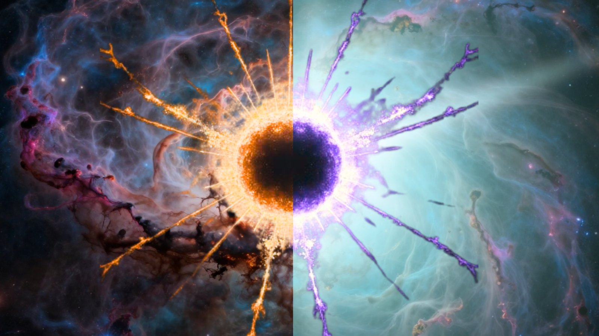

**摘要：** 美国宾夕法尼亚州立大学 Eberly 理工学院的研究者 Daniel Paraizo 与合作者通过半经典模型重新计算了原初黑洞（primordial black hole）经霍金辐射蒸发后的命运。结果显示，那些初始质量落在特定区间的黑洞在抵达普朗克质量（约 20 微克）时，并不会简单地"消失"，而是可能进入一个稳定的终态——从远处观测，这一终态的性质与假想中的"白洞"（white hole）完全无法区分。论文预印本已发布在 arXiv 上。

## 研究背景：为什么是原初黑洞

天文学家目前观测到的黑洞大都是大质量恒星坍缩形成的"恒星级黑洞"，质量在几个到几百个太阳质量之间。它们的霍金辐射极其微弱，蒸发时间远超宇宙年龄。

但理论还预言另一类黑洞——**原初黑洞**——可能在大爆炸后极早期由高密度涨落直接形成，质量可以非常小，从远小于一吨到几十亿吨不等。1970 年代以来，Stephen Hawking 提出这类小质量黑洞会通过热辐射蒸发，越小的黑洞温度越高、蒸发越快，理论上一颗一吨重的原初黑洞几乎"瞬间"就会炸开。

问题是：霍金辐射模型在黑洞接近**普朗克质量**（约 20 微克，相当于一根眉毛或一颗跳蚤卵的重量）时失效。普朗克尺度下，现有的广义相对论和量子力学不再兼容——这是物理学未解的核心难题。黑洞抵达这一尺度后究竟会"凭空消失"、"反弹"，还是变成其他天体，一直是理论家争论的焦点。

## Paraizo 团队的计算

Paraizo 团队选择了一条"少假设"路线：他们**只用半经典模型**（即把广义相对论与量子场论在低能区结合）描述远离黑洞视界的物理，而不去猜测视界附近或视界内部发生了什么。

结果显示：质量约 10 亿吨的原初黑洞需要约 10 亿年才能辐射至普朗克质量；而质量仅 1 吨的黑洞则"瞬间"完成蒸发。一旦抵达普朗克质量，黑洞不再以热辐射形式损失能量，**进入一个稳定相**。

Paraizo 在接受 Space.com 采访时解释：

> "我们发现黑洞的寿命比此前认为的要长得多。我们识别的现象与早期宇宙可能形成的黑洞有关——这些天体虽然尚未被观测到，但作为暗物质候选者，搜寻它们是当前非常活跃的研究方向。"

> "我们能从远距离物理的简单假设中推出黑洞的寿命，以及它们向一个看起来像 20 微克白洞的稳定相的转变。**只用最少的量子引力输入**就能推断出这些性质，是很了不起的。"

## 与"白洞"的联系

白洞是黑洞的"时间反演"——黑洞吞噬一切，白洞则不断向外推物质和辐射。它同样是理论上存在、但从未被观测到的天体。

新研究的关键论断是：原初黑洞抵达普朗克尺度后的那个"稳定相"，**从远处看**与一个 20 微克的白洞在物理性质上完全一致。

Paraizo 团队谨慎指出，他们并未直接证明这就是白洞——因为这需要一套完整的量子引力理论来描述白洞的内部机制。论文措辞是"具有白洞外观的稳定终态"，而非"黑洞真的变成了白洞"。

要进一步判断这些原初黑洞的命运，需要一种能够统一广义相对论和量子力学的"量子引力"理论，而该理论自 20 世纪初以来一直未完成。

## 论文与可获取性

该研究的预印本已发布在 arXiv 上。研究的同行评审版本预期将在正式期刊发表。

## 信息来源（原文）

- [Can black holes turn into white holes? It's not such a crazy idea, scientists say — Space.com](https://www.space.com/astronomy/black-holes/can-black-holes-turn-into-white-holes-its-not-such-a-crazy-idea-scientists-say)
