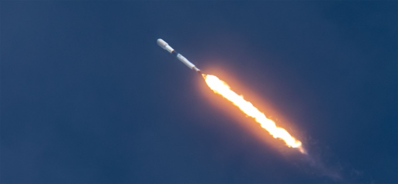

# Starlink 17-47 从范登堡升空，SpaceX 完成第 618 次一级回收

**摘要：** 2026 年 6 月 3 日美东上午 11:40:39（UTC 15:40:39），SpaceX 从加州范登堡太空军基地 SLC-4E（Space Launch Complex 4 East）发射猎鹰九号火箭，把 24 颗 Starlink V2 Mini Optimized 宽带卫星送入低地球轨道。任务编号 Starlink 17-47。升空约 8 分钟后，助推器 B1088 第 16 次飞行后落在太平洋上待命的无人船 Of Course I Still Love You（OCISLY）甲板——这既标志这艘 2017 年改装下水的老牌无人船累计第 200 次回收，也把 SpaceX 整个一级回收序列推到了第 618 次。

## 任务与硬件

- **载荷：** 24 颗 Starlink V2 Mini Optimized 卫星
- **一级助推器：** B1088，第 16 次飞行，曾执行 NASA SPHEREx、Transporter-12、NRO-L126 等任务
- **回收平台：** 无人船 Of Course I Still Love You（OCISLY），位于太平洋
- **发射场：** 范登堡太空军基地 SLC-4E
- **轨迹：** 起飞后向南-西南方向飞，倾斜入低地球轨道
- **升空时间：** 美东 6 月 3 日 11:40:39（UTC 15:40:39；PDT 08:40:39）
- **部署确认：** 美东 6 月 3 日 11:50（UTC 15:50），SpaceX 官方确认 24 颗卫星已成功释放

## 两个里程碑

- **OCISLY 第 200 次回收**：这艘船是 SpaceX 三艘现役无人船中最早投入使用的，2017 年 2 月首次接住猎鹰九号一级。从那之后，八年里它经历了太平洋的每一场海况；与同年稍早下水的 Just Read the Instructions（JRTI）一起承担西海岸回收任务，另一艘 A Shortfall of Gravitas（ASOG）则常驻东海岸。
- **SpaceX 第 618 次一级回收**：这是 SpaceX 自 2015 年 12 月首次回收以来累计的第 618 次猎鹰九号一级回收；按 Spaceflight Now 的统计口径，6/3 OCISLY 这次刷新了总数。

## 任务背景

Starlink 17-47 的 24 颗卫星隶属 V2 Mini Optimized 系列，是 SpaceX 2025 年起开始批量部署的二代小型化版本，单星质量比 V1.5 大但仍能装入猎鹰九号的整流罩。17-47 任务执行完毕后，整个 Starlink 在轨卫星数继续保持在 10,000 颗以上，构成全球规模最大的低轨宽带星座。

值得注意的是 6 月 3 日当天另一边的卡纳维拉尔角：猎鹰九号原计划在 SLC-40 发射 Starlink 10-43 任务的 29 颗卫星，但因 45 气象中队给出的可接受天气概率仅 30%，且南下的冷锋把积云云团、厚云层、表面电场三条规则中的多条同时触发，发射在美东 7:24（UTC 11:24）被取消，下一窗口落在 6 月 4 日凌晨。范登堡与卡角在 19 小时内分别完成（17-47）与未完成（10-43）两场 Starlink 任务，是 SpaceX 周末连轴转的典型节奏。

## 信息来源（原文）

- [Spaceflight Now: SpaceX launches 24 Starlink satellites on Falcon 9 rocket from Vandenberg](https://spaceflightnow.com/2026/06/03/live-coverage-spacex-to-launch-24-starlink-satellites-on-falcon-9-rocket-from-vandenberg-3/)
- [SpaceX 主页：Starlink 任务列表](https://www.spacex.com/launches/)
