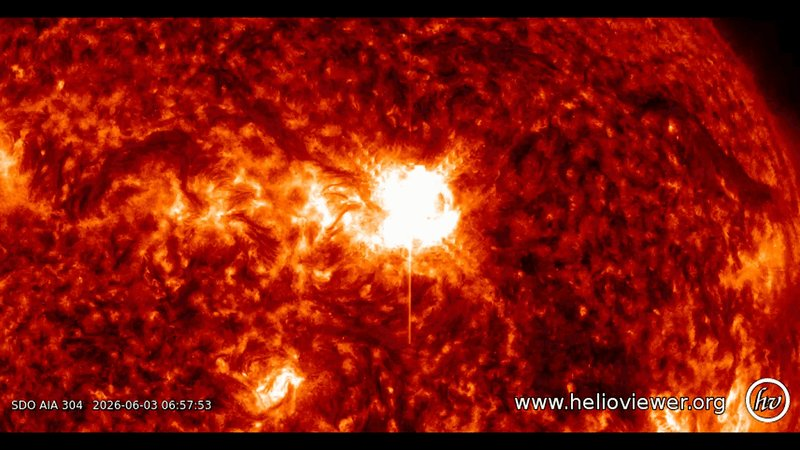

# 太阳24小时内连爆三次强耀斑：M9.3、M7.9、X1 接踵而至，NOAA 升 G3 地磁暴预警

**摘要：** 6月2日至3日（UTC），日面正对地球的太阳黑子活动区 AR4455 在不足 24 小时内连续爆发三次显著耀斑：M9.3（6月2日 01:36 UTC）、M7.9（6月2日 07:00 UTC）、X1（6月2日 11:28 UTC）。X 级是太阳耀斑的最高等级。美国国家海洋和大气管理局（NOAA）空间天气预报中心（SWPC）已为 6月4-6日发布强地磁暴（G3）预警，并提示存在孤立 G4 严重状况的微弱可能。M9.3 伴随的日冕物质抛射已被英国气象局确认朝向地球，预计 6月4日抵达，期间地球经历 R2-R3 级无线电中断。

## 三次耀斑的具体时刻与等级

三次耀斑均源自地球朝向的同一活动区 AR4455。Space.com 依据 NOAA SWPC 数据梳理的时间线如下：

- M9.3 级：6月2日 21:36 EDT（6月3日 01:36 UTC）达到峰值，是三次中最先出现的一次
- M7.9 级：6月3日 03:00 EDT（6月3日 07:00 UTC）紧随其后
- X1.0 级：6月3日 07:28 EDT（6月3日 11:28 UTC）爆发，是三次中最强的一次，也是 X 级——太阳耀斑分级中最高的一档

## 无线电中断与可能的地磁暴

三次耀斑中，X1.0 触发了强 R3 级无线电中断，M9.3 与 M7.9 各伴随一次中等 R2 级中断。受影响区域包括东亚和北美的高频（HF）通信。

M9.3 之后被观测到一次"暗淡但高速"、明确朝向地球的日冕物质抛射。英国气象局已确认该 CME 预计在 6月4日抵达地球。M7.9 之后是否伴随第二次朝向地球的 CME 仍在分析中；X1.0 之后可能的 CME 轨迹尚未确定。

基于已确认的 CME 路径，NOAA SWPC 发布了 6月4-6日的 G3（强）地磁暴预警，并保留孤立 G4（严重）状况的微弱可能。

## 极光可见范围或将推至中纬度

若 CME 如预期抵达，地球磁层将受到扰动。极光通常局限于高纬度地区，但强地磁暴可将可见范围推向中纬度。NOAA 与英国气象局均提示：6月4日（周四）晚起，美国北部多个州以及英国等地或有机会在比往常更低的纬度看到极光。

## 科学家：AR4455 仍可能继续爆发

空间气象物理学家 Tamitha Skov 在 M9.3 爆发后在 X 平台写道："AR4455 继续生长，复杂度还在上升，未来至少 72 小时内 X 级耀斑风险将维持在高位。"极光追逐者 Vincent Ledvina 同日表示："三颗可能朝向地球的 CME 正在路上，"但具体速度与抵达时间仍在持续分析中。

AR4455 仍在演化，未来数日是否再次出现 X 级耀斑仍是未知数。

## 信息来源（原文）

- [Sun erupts with 3 colossal solar flares in less than 24 hours, boosting chances for northern lights (Space.com)](https://www.space.com/stargazing/auroras/sun-erupts-with-3-colossal-solar-flares-in-less-than-24-hours-boosting-chances-for-northern-lights)
