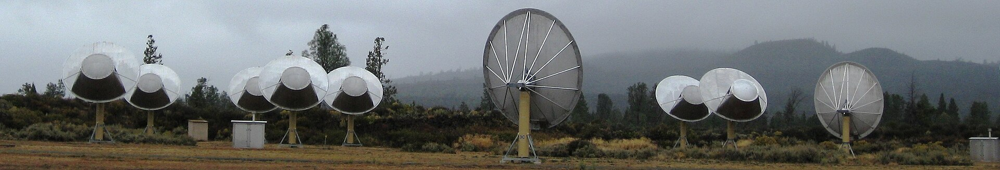

# 3I/ATLAS 不是外星飞船：SETI 监听未发现任何「技术签名」

**摘要：** SETI 研究团队 6 月 4 日公布对 3I/ATLAS 星际彗星的艾伦望远镜阵列（Allen Telescope Array）观测结果：尽管扫描了多个窄带射电频段，研究人员没有探测到任何指向人造发射源的「技术签名」（technosignature）。这是首次在第三颗已知星际天体上系统开展技术签名搜索，结果进一步支持 3I/ATLAS 为自然天体的判断。

3I/ATLAS 是 2025 年 7 月发现的第三颗已知星际天体，轨道偏心率约 6.14，呈双曲线，意味着它起源于太阳系之外、可能已有数十亿年历史。与前两颗星际访客——1I/ʻOumuamua（2017）和 2I/Borisov（2019）相比，3I/ATLAS 直径更大、活动更显著，因而从发现之初就伴随「会不会是外星飞船」的猜测。SETI Institute 团队利用位于加州北部的艾伦望远镜阵列对 3I/ATLAS 进行了窄带射电观测，扫描多个常用通讯频段，未发现任何持续性、规律性或带宽匹配人造发射的非自然信号。

3I/ATLAS 在 2025 年 10 月与火星发生约 0.194 天文单位的近距离飞掠，为火星轨道上的多个航天器提供了独特的观测视角。中国天问一号搭载的高分辨率成像相机（HIRIC）对 3I/ATLAS 进行了多次成像，相关研究成果于 5 月发表在《天体物理杂志快报》（ApJL），首次从火星轨道记录到星际天体的尘埃活动特征。同期，天文学界在鲁宾天文台（Vera C. Rubin Observatory）的历史观测档案中发现，3I/ATLAS 早在 2025 年 6 月 21 日至 7 月 2 日期间即被记录在案，比正式发现时间提前了至少一周。

从「提前发现」到「火星轨道视角」再到「SETI 技术签名搜索」——3I/ATLAS 的观测在今年陆续铺开，技术签名搜索的负结果虽然不能让「外星飞船」的猜测彻底销声匿迹，但确实为天体物理学界将其归类为自然天体提供了又一组独立证据。

## 信息来源（原文）

- [Interstellar comet 3I/ATLAS is not an alien spacecraft: SETI hunt for 'technosignatures' comes up empty（Space.com 2026-06-04）](https://www.space.com/space-exploration/search-for-life/not-an-alien-spacecraft-hunt-for-technosignatures-around-interstellar-comet-3i-atlas-comes-up-empty)
- [天问一号 HIRIC 观测 3I/ATLAS 尘埃活动（cislunarspace 2026-05-20）](https://cislunarspace.cn/space-news/2026/05/2026-05-20-tianwen-1-interstellar-dust/)
- [天文学家发现「隐身」星际彗星 3I/ATLAS 早在正式发现前已现身（cislunarspace 2026-05-16）](https://cislunarspace.cn/space-news/2026/05/2026-05-16-interstellar-comet-3i-atlas/)
