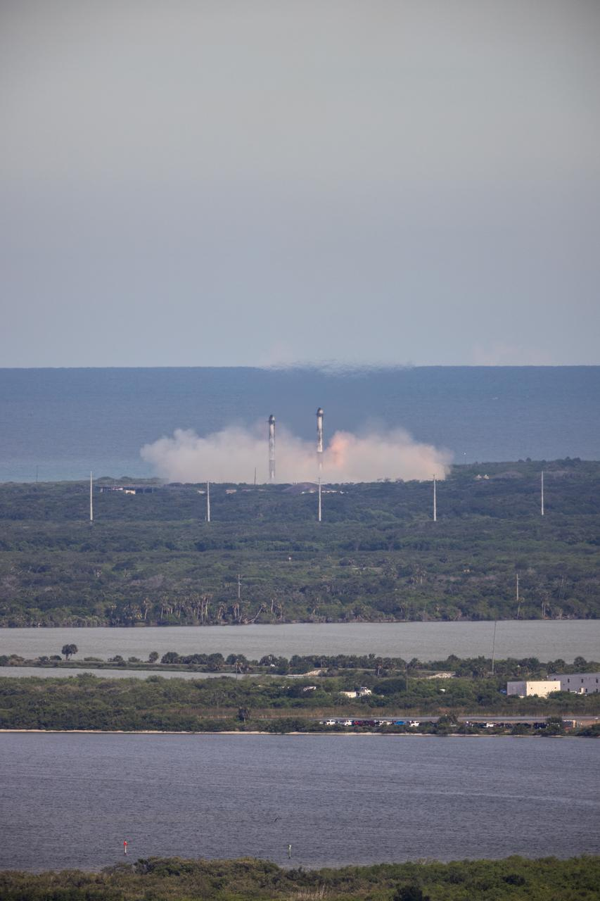

# 中国可重复使用火箭进入密集试验期：朱雀三号遥二、星云一号、长征十号乙排队冲击回收

**摘要：** 6 月 3 日财联社盘前头条与 6 月 4 日多家券商研报共同确认：从 6 月起，中国可重复使用火箭将进入一波「密集试验期」——蓝箭航天朱雀三号遥二箭瞄准 2026 年上半年再次挑战一子级垂直回收、四季度争取首次回收复用飞行；深蓝航天星云一号、中科宇航力箭系列改进型、中国商火自建的长征十号乙等多型可重复使用火箭排队入场。结合 2 月 220 吨级液氧甲烷发动机「蓝焱」长程试车完成、6 月 1 日长征十二号乙 20 吨级首飞成功（虽未进行回收），中国商业航天「运力—复用—产能」三道窄门正同时被推开。

## 6 月起密集试验：四型火箭同台竞技

财联社 6 月 3 日盘前头条在复盘长征十二号乙首飞行情时明确指出：「**6 月起，朱雀三号遥二、星云一号、长征十号乙等可重复使用火箭试验将密集进行，回收技术有望实现突破**」——这是当前公开口径里对中国 2026 年内可重复使用火箭时间表最完整的概括。

四型火箭分别代表四条技术路线：

- **蓝箭航天 朱雀三号（液氧甲烷）**：2025 年 12 月 3 日首飞成功入轨，但一子级在回收段点火异常、坠于回收场坪边缘 40 米处，是国内首次对入轨级运载火箭尝试一级回收。**遥二箭 2026 年 4 月已出厂**，瞄准 2026 年上半年再挑战一子级垂直回收，按结果决定 2026 年四季度是否争取首次回收复用飞行。
- **深蓝航天 星云一号（液氧煤油）**：国内首款可重复使用不锈钢液体运载火箭，与朱雀三号构成「液氧甲烷 vs 液氧煤油」双线对比。
- **中国商火 长征十号乙**：在长征十号甲（用于发射梦舟载人飞船）基础上的可重复使用改型，瞄准 2027-2028 年载人月球探测登月阶段任务的运力基础。
- **中科宇航 力箭系列改进型**：固体可重复使用方向，依托力箭一号 2025 年内已实现的「百星入轨」批量发射能力。

## 从「首飞即失败」到「遥二再挑战」：可复用火箭的工程学门槛

可重复使用火箭是商业航天的「关键核心技术之一」——理由很直白：要让每年 200 颗、500 颗、最终上万颗的低轨巨型星座上天，发射成本必须下降到「一次性火箭」的几分之一，而回收复用是唯一路径。

但「回收复用」这四个字的技术门槛比想象中高得多。SpaceX 猎鹰 9 号 Block 5 从 2017 年定型到 2024 年稳定复用超 20 次，中间经历了 7 年的迭代；中国商业火箭公司要走的路也类似。

**蓝箭航天朱雀三号的 12 月首飞回收失败是一个典型的「工程化首飞就遇到问题」**——火箭二级入轨精度、所有动作均正常，但一子级在着陆段反推发动机点火后出现异常，导致回收段「差最后一公里」。这种失败本身有价值：把问题暴露在真空中而不是在 PPT 上。**遥二箭的核心改进就是针对那次回收异常做归零整改**——蓝箭航天 2026 年 4 月已官宣遥二完成全部归零整改、正式进入出厂阶段。

## 长征十二号乙的「隐线」：未进行回收的首飞

值得特别指出的是，6 月 1 日首飞成功的**长征十二号乙**（CZ-12B）虽然不是一型可重复使用火箭的「回收首飞」，但它在回收方向上做了**返场气动外形的飞行验证**——这是为后续「择机开展一子级回收试验」打基础。

长征十二号乙由中国商火抓总研制，单芯两级构型、箭体直径 4.37 米、整流罩直径 5.2 米、全箭长约 72 米、一子级用 9 台 YF-102R 液氧煤油发动机、近地轨道运力 20 吨级，**是国内当前运力最大的单芯级火箭**。6 月 1 日 16 时 40 分在东风商业航天创新试验区点火升空，将千帆星座第十批组网卫星送入预定轨道，**首飞即成功入轨**，且在飞行中**验证了返段气动外形**——这条「返场」就是为后续回收试验铺路。

## 220 吨「蓝焱」：大推力液氧甲烷的工程化突破

在「密集试验期」之前，2026 年 2 月底蓝箭航天已宣布其 220 吨级液氧甲烷全流量补燃循环发动机「**蓝焱**」完成整机全系统长程试车，标志中国在大推力高性能液体火箭发动机领域取得关键突破。截至 2026 年 2 月底，蓝箭航天发动机累计试车时长已超 16 万秒、有 41 台发动机经历过真实飞行——这是后续「密集试验」能够排上日程的工程基础。

## 「千帆 + 千帆二期 + 巨型星座」逼出来的时间表

为什么是现在？答案在低轨星座的发射需求侧。截至 6 月 1 日，仅千帆星座在轨卫星数量已增至 164 颗；上海垣信卫星已明确**2026 年目标部署 108 颗以上**；面向「手机直连 + 宽窄带物联网」业务，星座规模终将走向万颗量级。

按「一箭 18 星」典型节奏，108 颗要 6 次发射、500 颗要近 30 次、1000 颗要近 60 次——**如果每一次都是一次性的**，总成本会让商业闭环无法成立。这就是为什么「可重复使用火箭」从「锦上添花」变成「生死线」。

## 信息来源（原文）

- [蓝箭航天朱雀三号等多型可回收火箭将开展密集试验——财联社 / 每日经济新闻（6/3 报道）](https://www.sohu.com/a/1031007375_115362) — 2026-06-02 13:00
- 【盘前头条】商业航天突发利好消息——新浪财经（6/3 08:28）](http://finance.sina.com.cn/wm/2026-06-03/doc-iniaarqw2615156.shtml)
- [朱雀三号遥二火箭进入最后准备阶段，瞄准垂直回收技术新突破——澎湃（5/13 报道）](https://so.html5.qq.com/page/real/search_news?docid=70000021_5706a03541363852)
- [蓝箭航天张晓东：朱雀三号 2026 上半年遥二箭回收试验 四季度力争首次复用飞行——同花顺财经（4/3 太空算力产业大会演讲）](http://stock.10jqka.com.cn/20260403/c675758324.shtml)
- [蓝箭航天 220 吨级发动机完成长程试车——今日头条 / 蓝箭航天官方披露](https://www.toutiao.com/article/7614004787306119743/) — 2026-03-06
- [中国长征十二号乙火箭首飞成功——新华社 / 央视新闻](http://www.ce.cn/xwzx/gnsz/gdxw/202606/t20260601_3003016.shtml) — 2026-06-01
