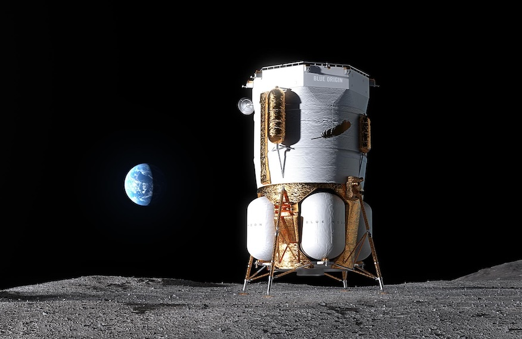
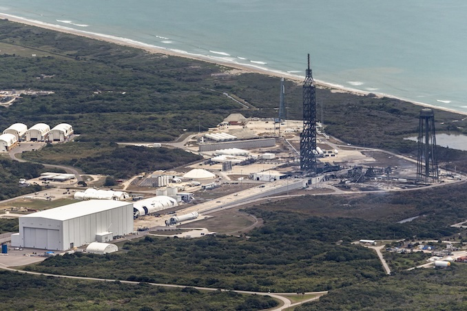

# NASA 局长 Isaacman 首度表态：Blue Moon 着陆器将与新格伦脱钩 寻找新发射载具

**摘要：**5 月 28 日 Blue Origin 新格伦火箭在 LC-36 静态点火测试中爆炸一周后，NASA 局长 Jared Isaacman 在 FOX Business 周四（6 月 4 日）采访中首次公开表态：NASA 希望将 Blue Moon MK1 货运着陆器以及可能涉及的 MK2 载人着陆器从新格伦火箭上"解耦"，转而寻找其他运载火箭。Isaacman 强调 Artemis 3 仍按 2027 年测试、2028 年实现载人登月的目标推进，NASA 将以"全政府响应"方式应对此次事故。

## "把着陆器与火箭、与发射台脱钩"

在采访中，Isaacman 明确说出了三个关键判断。首先是"着陆器与运载火箭、与发射台解耦"——"We are also de-coupling the lander from the launch vehicle and the pad itself,"他说道。这意味着 NASA 不再把 Blue Moon 系列着陆器的命运完全绑在新格伦与 LC-36 上。

第二个判断关乎时间表。Isaacman 表示："NASA is laser focused on the lander because we're laser focused on our mission to return astronauts to the surface of the moon before 2028, and we're gonna be able to keep that lander in development, progressing, so it's available for our test mission in 2027, which is Artemis 3, and potentially available to meet our landing objectives in 2028." 换言之，Artemis 3 的着陆器必须按 2027 年测试任务节点就位、并力争支撑 2028 年登月目标，时间不再宽裕。

第三个判断是事故定性。Isaacman 把这次静态点火事故视作"这个行业的常态"——"It's a setback that happens in this business. It's incredibly complicated. A rocket is a controlled explosion,"他强调，关键是从中学习、推进下一步。

## 涉事范围：MK1 货运 + MK2 载人

一位 NASA 发言人对 Spaceflight Now 进一步澄清：NASA 希望看到 Blue Moon Mark 1 货运着陆器、以及"潜在的"Blue Moon Mark 2 载人着陆器改用非新格伦的运载火箭。换言之，MK2 载人也可能一并换掉，但措辞留了余地——"potentially"。

后续选项的清单尚未公开，但新格伦之外、具备送 Blue Moon 这种吨位载荷奔月能力的现役美国火箭本就不多：ULA 的 Vulcan Centaur、SpaceX 的 Falcon Heavy、理论上还有未来 SpaceX Starship 都属可考虑范围。Artemis 体系内部历来存在 SpaceX Starship HLS 与 Blue Moon HLS 两条载人月面着陆路径，NASA 此次首次在公开层面把 Blue Moon 系列与新格伦切割，无形中也让项目竞合格局出现新的变量。

## 现场视角

5 月 28 日事故是 Cape Canaveral 太空军基地（CCSFS）迄今"最大的一次爆炸"——CCSFS 第 45 太空发射联队指挥官 Brian Chatman 上校给出了这一定性。爆炸未造成人员伤亡，Chatman 与 Blue Origin 官员当晚即确认这一点。事故次日，Isaacman 与 NASA 数名高级工程师飞抵佛罗里达，与 Blue Origin 工程师直接沟通并查看 LC-36 现场损毁。Isaacman 当场承诺 NASA 将协助查找事故根因，并力争"尽快安全地"恢复新格伦发射。

## Blue Origin 的复飞时间表

在 NASA 此次表态之前，Blue Origin 一侧已给出复飞节奏。6 月 1 日，Blue Origin CEO Dave Limp 在社交媒体上表示：LC-36 的推进剂储罐"状况良好"，大型支援塔"可以原地修复，不必拆除重建"。Limp 以此收尾："We will fly again before the end of this year."——"我们将在今年年底前再次飞行。"

这是 Blue Origin 在事故后的首次公开修复进度表态，与 NASA 此次要求"换载具"形成耐人寻味的张力：Blue Origin 强调新格伦可恢复，NASA 则着眼"与运载火箭脱钩"。两条线索虽不直接冲突，但反映出 NASA 在 Blue Moon 时间表上的风险容忍度正进一步收紧。

## 后台语气

Isaacman 还在 X 平台发文："We have been saying for months at NASA that we are not going to sit on our hands and wait for the capabilities necessary to achieve the nation's most pressing objectives. We are going to take an active role alongside our partners, just as we did in the 1960s, to overcome setbacks, remove obstacles, and deliver the intended outcomes."——"我们在 NASA 已经讲了几个月：我们不会坐等实现国家最紧迫目标所必需的能力。我们将与合作伙伴一道主动出击，就像 1960 年代那样，克服挫折、扫除障碍、达成预定结果。"

把当下与阿波罗时代的"全政府动员"作类比，是 NASA 局长在重大挫折后惯用的修辞——意在向国会、合作伙伴与公众传递"目标不变、机制升级"的信号。

## 小结

此次表态可视为 NASA 对 LC-36 事故的首次正式政策回应：在着陆器侧继续 Blue Moon MK1/MK2 的开发与备货，在运载侧则首次明确希望"换掉"新格伦。其短期影响是 Artemis 3（2027 测试、2028 登月）的时间表压力进一步显性化；中长期则可能重塑美国"国家队"月面运力的供应版图。

## 信息来源（原文）

- [NASA head urges new launcher for Blue Origin's moon landers to meet Artemis mission deadlines — Spaceflight Now](https://spaceflightnow.com/2026/06/04/nasa-head-urges-new-launcher-for-blue-origins-moon-landers-to-meet-artemis-mission-deadlines/)
- [Blue Origin's New Glenn rocket explodes during prelaunch testing at Cape Canaveral — Spaceflight Now](https://spaceflightnow.com/2026/05/29/blue-origins-new-glenn-rocket-explodes-during-prelaunch-testing-at-cape-canaveral/)
- [Blue Origin vows to resume New Glenn flights by year's end — Spaceflight Now](https://spaceflightnow.com/2026/06/03/blue-origin-vows-to-resume-new-glenn-flights-by-years-end/)
