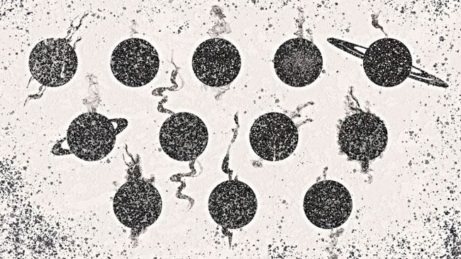

# 欧几里得望远镜在球状星团 NGC 6397 中发现一片「失踪的恒星」

**摘要：** 欧空局（ESA）欧几里得空间望远镜拍摄的 NGC 6397 球状星团图像中，科学家在恒星光度-颜色分布图（H-R 图）上发现了一段不应存在的「空隙」——特定亮度的恒星在该区域几乎完全缺失。空隙出现在红矮星序列中，研究者认为与红矮星内部从「部分对流」过渡到「完全对流」时结构与光度的细微变化有关。这不是事先寻找的目标，而是研究恒星运动学时的「意外发现」。

## 一张"完整的图"，却带一处缺口

NGC 6397 位于天坛座方向，距离地球约 7,800 光年，是全天最靠近太阳的球状星团之一。它容纳数十万颗恒星，年龄约 134 亿年，是研究古老恒星群体的天然样本。当研究者把欧几里得与哈勃太空望远镜的观测数据汇总，把星团中恒星按亮度和颜色（即表面温度）逐颗画在 H-R 图上时，原本应该平滑分布的红矮星序列里出现了一段清晰的「空白」。

STScI 的新闻稿描述这种空隙的视觉印象：「像一整片星海里突然少了一格亮度档。」正常情况下，相邻亮度档的恒星数量应当连续变化；而在 NGC 6397 图像的对应亮度处，恒星数量骤降。

## 可能是红矮星内部的一次「换挡」

研究者给出的物理解释指向红矮星的对流结构。红矮星是银河系中最常见的恒星类型，质量约为太阳的 7.5%–50%。在低质量端，红矮星内部最初是「部分对流」——即外层与内核之间的物质循环并不完全。质量更低或演化更晚的红矮星则进入「完全对流」状态，整个恒星内部物质充分混合。

这两种状态切换时，恒星半径、温度与光度会发生不连续变化。研究者认为，NGC 6397 中那段空缺的亮度档位对应的恒星，正处于这两种结构之间的过渡区——它们在该亮度上的「驻留时间」极短，因而在 H-R 图上呈现为一段几乎不出现恒星的带状空隙。

## 一次被设计目标之外的意外

欧几里得望远镜的主要科学任务是绘制暗物质与暗能量的三维分布，星团观测只是其广域巡天中顺便捕获的目标。研究者原本在做的事情是分析 NGC 6397 内恒星的运动学（proper motions），借助欧几里得与哈勃的视场叠加精度追踪每颗恒星在天空中的位移。恒星分布的「空隙」并非这次的研究目标，而是在分析恒星群体结构时浮现出来的。

> 「这个发现是意外之喜。我们原本在找的不是空隙，而是它自己跳出来的。」
> 「The discovery was serendipitous. We were not looking for the gap, but we found it.」

——Andrea Bellini，论文第一作者，STScI

## 数据规模与后续工作

NGC 6397 内部数十万颗恒星都被欧几里得的高分辨率成像仪记录下来，构成本次空隙发现的统计基础。研究团队的下一步是检查欧几里得巡天中其他球状星团是否也存在类似的亮度空隙，以及这一空隙的边界亮度是否与理论预言的「部分对流→完全对流」转换点一致。如果一致，这种 H-R 图上的「缺口」将成为一种新的观测探针，帮助天文学家在远距离星团中标记出红矮星结构转换的发生位置。

## 意义

球状星团是检验恒星演化模型的「标准烛光样本」：年龄相近、金属丰度相同、距离相同的恒星群体让 H-R 图上的统计偏差更容易被识别。NGC 6397 空隙的发现意味着：即便是已研究数十年的近邻球状星团，欧几里得的高精度测光与位置数据仍能揭示此前未见的恒星结构细节。这类「空隙」也将帮助欧几里得团队在更大尺度的暗物质测绘中，校正红矮星物理对光度函数估计的影响。

## 信息来源（原文）

- [Space.com: Glittering star cluster image reveals missing patch of stars](https://www.space.com/astronomy/stars/glittering-star-cluster-image-reveals-missing-patch-of-stars-we-were-not-looking-for-the-gap-but-we-found-it)
- [Space Telescope Science Institute（STScI）官方发布](https://www.stsci.edu/)
