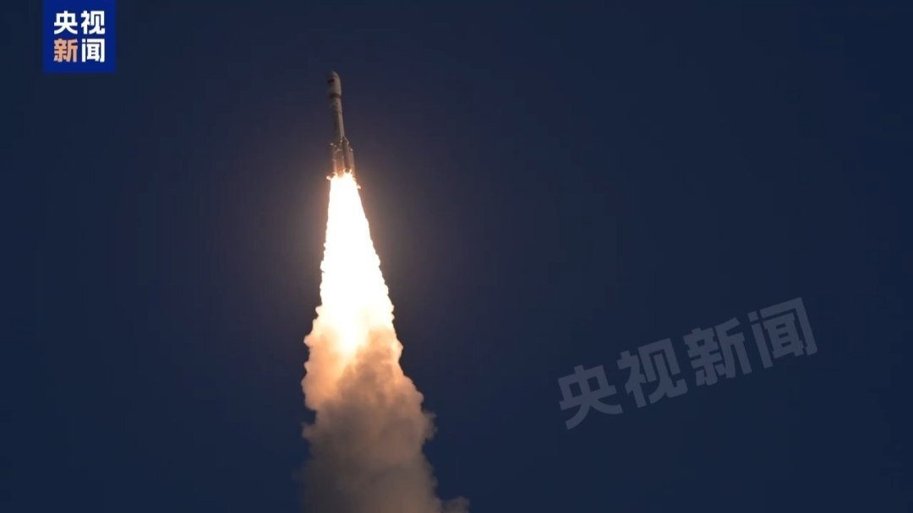

# 长征六号改一箭 18 星成功发射千帆极轨 11 组卫星 长征系列累计第 648 次飞行

**摘要：**6 月 4 日 19 时 39 分（北京时间），长征六号改运载火箭在太原卫星发射中心点火起飞，将千帆极轨 11 组卫星以"一箭 18 星"方式送入预定轨道，发射任务取得圆满成功。此次发射是长征系列运载火箭第 648 次飞行，也是在 6 月 1 日长征十二号乙首飞之后，中国 6 月份第二次完成星座组网发射。

## 任务核心：长六改 + 千帆 11 组

据中国航天科技集团 6 月 5 日凌晨发布的消息，6 月 4 日 19 时 39 分，长征六号改运载火箭在太原卫星发射中心点火起飞，随后将千帆极轨 11 组卫星送入预定轨道。新华社、中新社、中国日报网、中国网同源转引这一消息：发射任务取得圆满成功。

**运载火箭**：长征六号改由中国航天科技集团有限公司八院抓总研制，是一款"液体芯级+固体助推"两级半构型的新一代固液捆绑中型运载火箭，700 公里高度太阳同步轨道运载能力不小于 4.5 吨，可满足单星、多星串联、并联、堆叠、壁挂、搭载等多样化密集发射需求。

**任务载荷**：千帆极轨 11 组卫星共 18 颗，由航天科技集团所属长城公司作为总承包商提供发射服务。千帆星座是中国正在建设的低轨宽带互联网星座之一，"极轨"指轨道倾角接近 90 度、绕地球南北方向运行的轨道类型。

## 飞行第 648 次，长六改面对多雨天气提前预案

这次任务是长征系列运载火箭的第 648 次飞行。在中国长征系列火箭的"百次里程碑"序列中，648 是一个已经处于高频节奏的数字——今年 1 月底该系列已完成第 600 次飞行（参考 2 月 14 日长六改的星链 17-13 任务），而 5 月底到 6 月初，6 月 1 日长征十二号乙首飞、6 月 4 日长六改千帆 11 组、加上更早的长征八号甲、长征三号乙改、长征七号改等系列任务，密度可见一斑。

针对近期多雨天气情况，火箭试验队提前统筹谋划，全面排查作业流程与防雨防护措施，细化转运、吊装等关键工序作业规范，严格落实安全管控要求，确保产品安全。这一段中国网原稿的细节之所以重要，是因为长六改所捆绑的 4 台直径 2 米分段式固体助推发动机，对运输、储存与吊装环境的湿度敏感——去年 10 月那次长六改任务时，该批助推器在发射中心存放长达 80 天，专门验证了"分段式固体发动机长时间贮存下的气密变化规律"。

## 6 月节奏：第二次组网发射

此次发射是 2026 年 6 月中国第二次完成星座组网发射：

- **6 月 1 日 16:40**（北京时间），长征十二号乙遥一运载火箭在东风商业航天创新试验区首飞，将千帆极轨 08 组卫星送入轨道——这是我国运力最大的单芯级火箭首飞，瞄准大规模低轨互联网星座组网，型号对标 SpaceX 猎鹰 9 号的中型液体运载火箭定位。
- **6 月 4 日 19:39**（北京时间），长征六号改在太原完成千帆极轨 11 组卫星发射。

两发间隔不到 90 小时，分别使用了**新研液体可重复使用火箭**与**成熟的固液捆绑中型火箭**两条技术路线，反映出 6 月起中国可复用火箭密集试验期与商业航天高密度组网两条主线并行推进的状态。

## 千帆星座的组网节奏

千帆星座是中国正在规模化建设中的低轨宽带互联网星座。自 2024 年 8 月首批 18 颗组网卫星由长六改在太原成功发射以来，星座按"一箭 18 星"的批量模式推进：

- 2024 年 8 月 6 日，第一批 18 颗，长六改，太原；
- 2024 年 10 月 15 日，第二批 18 颗，长六改，太原；
- 2024 年 12 月 5 日，第三批 18 颗（全年累计 54 颗）；
- 2025 年 1 月 23 日，第四批 18 颗（在轨 72 颗，进入常态化）；
- …… 后续批次按月度节奏推进；
- 2026 年 5 月 12 日，第十批（千帆 09 组）发射（参考 5/12 站点文章）；
- 2026 年 6 月 1 日，千帆 08 组（与长十二乙首飞同发）；
- 2026 年 6 月 4 日，千帆 11 组（本篇报道）。

从 2024 年 8 月到 2026 年 6 月的近两年时间内，千帆以"18 颗/发"的稳定节奏组网，对应中国版"低轨宽带互联网"建设的核心载荷来源。在 6 月 1 日长十二乙首飞、6 月 4 日长六改持续稳定的背后，是商业航天高密度发射与可重复使用两条技术路线同步提速的格局。

## 信息来源（原文）

- [我国成功发射千帆极轨 11 组卫星 - 新华社（经中国之声转发）](https://so.html5.qq.com/page/real/search_news?docid=70000021_5096a21835594152)
- [一箭 18 星 中国成功发射千帆极轨 11 组卫星 - 中新社（经腾讯网转发）](https://so.html5.qq.com/page/real/search_news?docid=70000021_4056a21900629152)
- [长六改火箭成功发射千帆极轨 11 组卫星 - 中国网](http://news.china.com.cn/2026-06/05/content_118531825.shtml)
- [千帆极轨 11 组卫星发射成功 - 新华社（经腾讯网转发）](https://so.html5.qq.com/page/real/search_news?docid=70000021_4266a217f9918052)
