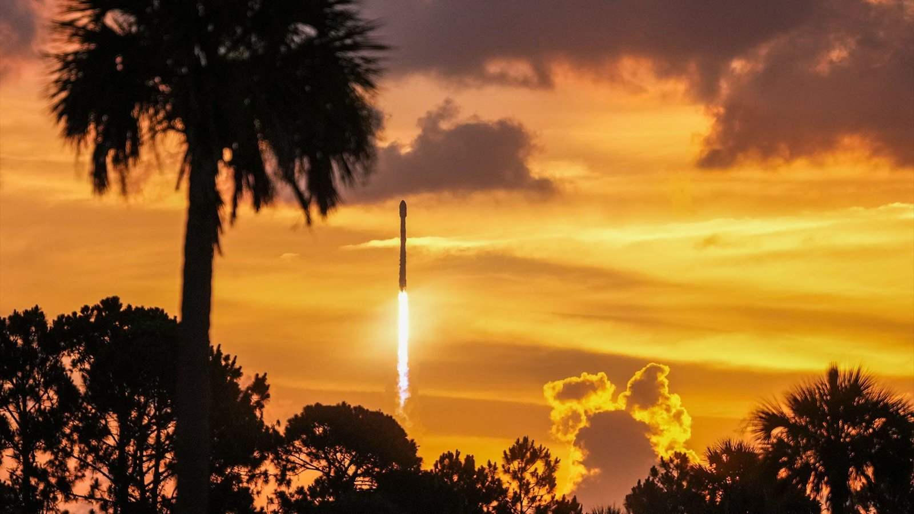

# Starlink 10-43 在卡角 24 小时窗口外完成补飞：SpaceX 累计第 619 次一级回收

**摘要：** 在 6 月 3 日因冷锋带来的积云云团、厚云层、表面电场多条天气规则同时触发而取消原窗口 31 小时后，SpaceX 于 6 月 4 日美东上午 6:26（UTC 10:26；EDT 已自凌晨起算）从卡纳维拉尔角太空军基地 SLC-40 成功发射 Starlink 10-43 任务。猎鹰九号把 29 颗 V2 Mini Optimized 宽带卫星送入低地球轨道，约 65 分钟后 SpaceX 官方确认部署完成。升空约 8 分钟，助推器 B1090 在第 12 次飞行后落回大西洋上的 A Shortfall of Gravitas（ASOG）无人船甲板——这是 ASOG 第 153 次成功回收，也把 SpaceX 整个一级回收序列推到了第 619 次。10-43 是 SpaceX 2026 年第 64 次猎鹰九号发射，与前一日的 Starlink 17-47（UTC 15:40 从范登堡起飞）合在一起，24 小时内完成 53 颗卫星入轨，让 Starlink 在轨活跃卫星数突破 10,500 颗。

## 任务与硬件

- **载荷：** 29 颗 Starlink V2 Mini Optimized 卫星
- **一级助推器：** B1090，第 12 次飞行，曾执行 NASA Crew-10、CRS-33、Bandwagon-3、O3b mPOWER-E、mPOWER-D 等任务
- **回收平台：** 无人船 A Shortfall of Gravitas（ASOG），位于大西洋佛罗里达近海
- **发射场：** 卡纳维拉尔角太空军基地 SLC-40
- **轨迹：** 起飞后向东北方向飞，沿佛罗里达东海岸进入低地球轨道
- **升空时间：** 美东 6 月 4 日 06:26（UTC 10:26；EDT 06:26）
- **部署确认：** 美东 6 月 4 日 07:31（UTC 11:31）左右，SpaceX 官方确认 29 颗卫星已成功释放
- **一级着陆：** 美东 6 月 4 日 06:34 前后，ASOG 完成回收

## 6 月 3 日 scrub 与 24 小时补飞

6 月 3 日美东上午 7:24（UTC 11:24），Spaceflight Now 现场跟踪页发出"`SpaceX scrubbed the launch`"。第 45 气象中队当日的预报产品把规则触发情况列得清楚：南下的 marine showers 擦过东中佛罗里达海岸，中云层明显偏多，对积云云团和厚云层两条规则都构成实质威胁；表面电场规则在 shower 进一步增强时也加入候选。原窗口 6 月 3 日美东 06:00–09:43 关闭后，SpaceX 顺势把下一窗口挂在 6 月 4 日凌晨 4:00（UTC 08:00）起。

6 月 4 日凌晨的窗口同样遭遇短时推迟。SpaceX 官方 T-0 时刻从美东 04:00 一直推到 06:26——45 中队当日天气评分为「可接受」，但 4:00–5:30 区间仍存在积云云团反复触发的风险，SpaceX 自身的地面流程也在按 30 分钟一档的窗口节奏重新对齐。直到 6:26，猎鹰九号在 SLC-40 升空，B1090 与 29 颗 V2 Mini Optimized 卫星进入低地球轨道，整个补飞任务才正式完成。SpaceX 没有为这次补飞发布单独新闻稿，4 日 18:00 左右的合并回顾稿把两次任务并到一起做了记录。

## 两个回收里程碑

- **ASOG 第 153 次成功回收**：A Shortfall of Gravitas 是 SpaceX 三艘现役无人船中专门承担东海岸回收任务的一艘，2020 年 8 月首次接住猎鹰九号一级。六年里它承担了 Crew Dragon 任务、商业拼车任务与几乎所有从卡角出发的 Starlink 任务的一级回收。10-43 是它累计第 153 次着陆。
- **SpaceX 第 619 次一级回收**：这是 SpaceX 自 2015 年 12 月首次回收以来累计的第 619 次猎鹰九号一级回收。10-43 与前一天 6/3 的 Starlink 17-47（OCISLY 第 200 次，SpaceX 第 618 次）合计在 24 小时内贡献了两次回收，把序列数从 618 直接推到 619。

## 与 6/3 范登堡发射的连轴

Starlink 10-43 与 Starlink 17-47 是 SpaceX 2026 年连轴转的典型节奏：6 月 3 日美东上午 11:40（UTC 15:40；PDT 08:40）从范登堡 SLC-4E 升空 17-47，把 24 颗 V2 Mini Optimized 卫星送入低地球轨道；不到 19 小时后，10-43 从卡角 SLC-40 升空，把 29 颗同样型号的卫星补进另一条轨道。两次任务的卫星数 24 + 29 = 53 颗，让 Starlink 在轨活跃卫星数从此前约 10,450 颗的水平抬升到 10,500 颗以上。Spaceflight Now 把这两次任务分别计为 SpaceX 2026 年第 63 次和第 64 次猎鹰九号发射。

值得注意的是两次发射的助推器路线差异：17-47 的 B1088 在西海岸 OCISLY 完成 16 次飞行的回收；10-43 的 B1090 在东海岸 ASOG 完成 12 次飞行的回收。OCISLY 在 6/3 创下第 200 次着陆里程碑后一天，ASOG 也把自己的累计次数推到了 153。

## 信息来源（原文）

- [SpaceX launches back-to-back Starlink missions from both coasts 19 hours apart (photos) — Space.com（Robert Z. Pearlman, 2026-06-04）](https://www.space.com/space-exploration/launches-spacecraft/spacex-starlink-17-47-b1108-vsfb-ocisly-10-43-b1090-ccsfs-asog)
- [Spaceflight Now: Poor weather forces launch scrub of SpaceX's Falcon 9 rocket from Cape Canaveral（2026-06-03）](https://spaceflightnow.com/2026/06/03/live-coverage-spacex-to-launch-29-starlink-satellites-on-falcon-9-rocket-from-cape-canaveral-15/)
- [SpaceX 主页：Starlink 任务列表](https://www.spacex.com/launches/)
