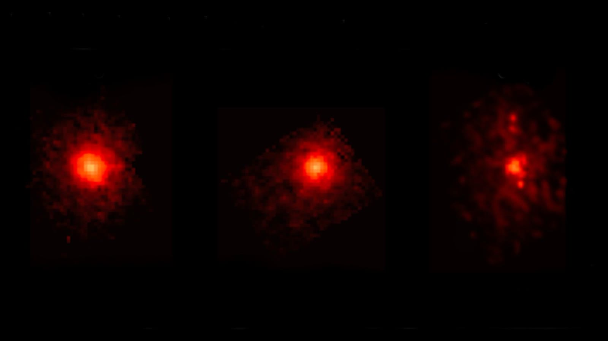

# 3I/ATLAS 经近日点后甲烷被首次探测：JWST 揭示星际彗星的化学指纹

**摘要：** 6 月 5 日发表在《天体物理学杂志快报》上的研究显示，詹姆斯·韦伯空间望远镜（JWST）的中红外仪器（MIRI）于 2025 年 12 月 15–16 日观测到 3I/ATLAS——已知第三颗星际天体——首次释放出甲烷。这是甲烷首次在星际天体上被确认，恰好发生在 3I/ATLAS 越过近日点（约 2025 年 10 月 29 日）后约七周；它的出现与一氧化碳释放同步抬升 40 倍相对二氧化碳形成呼应，说明这两种气体原本都被埋在彗核深处。同一组观测还测到水蒸气、二氧化碳乃至镍蒸气——后两者的相对丰度比太阳系彗星高出数倍，提示 3I/ATLAS 起源的恒星系形成环境与太阳系有显著差异。

3I/ATLAS 于 2025 年 7 月被确认，轨道偏心率约 6.14 的双曲线证实它来自太阳系之外，是继 1I/ʻOumuamua（2017 年）、2I/Borisov（2019 年）之后人类迎来的第三位星际访客。在 6 月 4 日 SETI Institute 公布对 3I/ATLAS 艾伦望远镜阵列窄带射电监听结果——未发现任何「技术签名」、继续支持它为天然天体的同一周，化学观测这边则用完全独立的途径去追问这颗天体的来路：它原本在一个什么样的低温原行星盘里凝结、又经历了什么样的热演化才让甲烷、CO、二氧化碳、水和镍依次从表面或内部释放。

JWST 的 MIRI 第一次把镜头对准 3I/ATLAS 是在 2025 年 12 月 15–16 日——距离 3I/ATLAS 越过近日点约 47 天、距离太阳约 2.20 天文单位（3.3 亿公里）。观测在 3I/ATLAS 刚走出近日点后不久的活跃期内进行，彗发因为太阳加热而显著抬升。论文第一作者、Caltech 学者 Matthew Belyakov 及其合作者在论文中写道：「3I/ATLAS 接近水冰线（约 2.5 AU）时，来自最冷表面和彗发的水生产开始关闭。」他们也观察到，水以气态形式在远离彗核的位置被喷出——冻结在彗发颗粒中的冰粒一旦进入更温暖的环境就升华，这正是 JWST 之前多次在太阳系彗星上看到的物理过程。

但最值得记录的新发现，是**甲烷**。它并不是稀有分子，在太阳系彗星里并不罕见，但前两颗星际天体——1I/ʻOumuamua 和 2I/Borisov——都从未被明确探测到过甲烷。3I/ATLAS 这次是「首次在星际天体上探测到甲烷」——而这个信号只在过近日点后才变得显著。论文给出的解释是：甲烷被埋在彗核的更深层，近日点后太阳的额外热量需要更长的时间才能渗透到那一层把甲烷「烤」出来升华；甲烷释放的延迟模式与 12 月观测到的一氧化碳释放相对二氧化碳 40 倍抬升相吻合——意味着 CO 和甲烷都来自彗核深处。

与此同时，二氧化碳与水蒸气的相对丰度在 3I/ATLAS 上也异常地高。论文指出：「尽管这些比例在太阳系里看起来反常高，但对于 3I/ATLAS 形成的那个恒星系——可能是 110–120 亿年前——来说可能很普通。」这意味着 3I/ATLAS 形成于一个化学条件与太阳系原行星盘明显不同的低温环境，二氧化碳和水冰可能在其形成时占主导。这与近期另一项基于 3I/ATLAS 尘埃活动化学分析得出的判断彼此印证——3I/ATLAS 不是在类太阳条件下凝结的。

论文同时也确认了一个更奇特的成分：镍蒸气。MIRI 在中红外波段测到 3I/ATLAS 喷出的气体中含镍原子，这一信号与 JWST 早期的近红外观测一致。这本身不是新信号——3I/ATLAS 在被发现后不久就被报告在彗发里发现镍蒸气——但新的中红外独立观测再次证实了这一点，说明镍的释放机制在 3I/ATLAS 上持续存在。

把这次发现放回 3I/ATLAS 今年的观测递进里看更清楚：5 月天问一号从火星轨道记录其尘埃活动；5 月底鲁宾天文台（Vera C. Rubin Observatory）历史观测档案追溯其 2025 年 6 月 21 日至 7 月 2 日期间就已经被记录在案；6 月 4 日 SETI Institute 用艾伦望远镜阵列扫描了多个射电频段，未发现人造信号；6 月 5 日 JWST 给出首个甲烷观测证据——这四组数据从不同尺度（尘埃活动 / 提前发现 / 射电监听 / 中红外化学）共同为同一颗天体画出了一张越来越完整的「星际访客」肖像。

甲烷的延迟释放、甲烷与 CO 的同步抬升、CO₂ 和水的高丰度比、镍蒸气的持续存在——这些化学指纹加在一起，把 3I/ATLAS 与太阳系彗星区分开来，也为研究远古老恒星系中的彗星形成提供了一个具体的参考样本。

## 信息来源（原文）

- [Interstellar comet 3I/ATLAS is blasting out a bunch of methane. Here's why that's weird（Space.com 2026-06-05）](https://www.space.com/astronomy/comets/interstellar-comet-3i-atlas-is-blasting-out-a-bunch-of-methane-heres-why-thats-weird)
- [天问一号 HIRIC 观测 3I/ATLAS 尘埃活动（cislunarspace 2026-05-20）](https://cislunarspace.cn/space-news/2026/05/2026-05-20-tianwen-1-interstellar-dust/)
- [3I/ATLAS 不是外星飞船：SETI 监听未发现任何「技术签名」（cislunarspace 2026-06-04）](https://cislunarspace.cn/space-news/2026/06/2026-06-04-3i-atlas-seti-no-alien-signals/)
