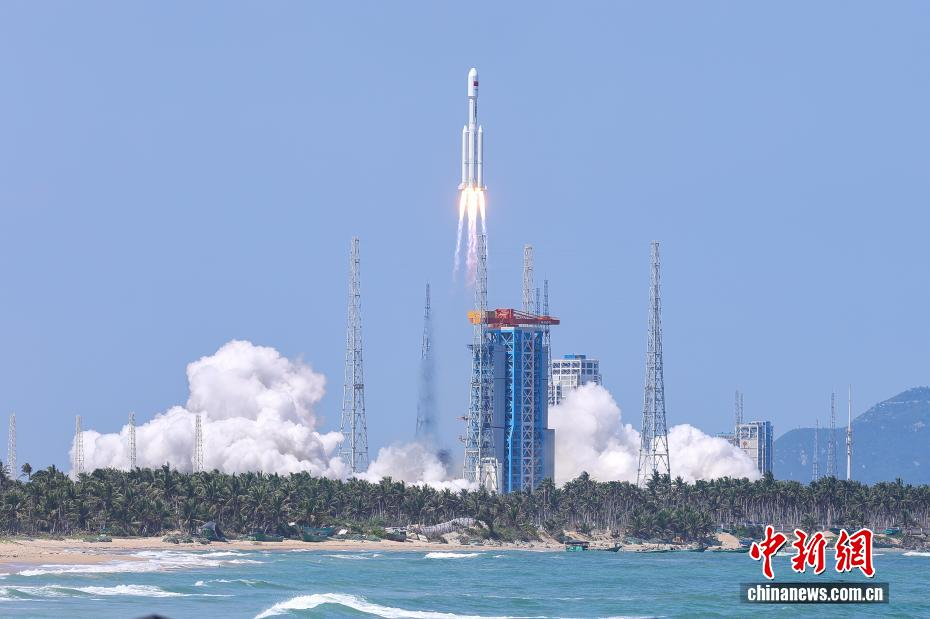

# 长征八号在海南成功发射千帆极轨 12 组卫星 海南商发首次承担千帆组网任务

**摘要：** 2026 年 6 月 5 日 14 时 34 分（北京时间，6 月 5 日 06 时 34 分 UTC），长征八号运载火箭在海南商业航天发射场点火起飞，将千帆极轨 12 组卫星准确送入预定轨道，发射任务取得圆满成功。这是海南商业航天发射场首次承担千帆星座组网发射任务，距 6 月 4 日太原长六改发射千帆极轨 11 组卫星尚不足 24 小时。

此次发射使用长征八号基本型运载火箭。长征八号由中国运载火箭技术研究院（航天科技集团一院）抓总研制，主要面向太阳同步轨道与近地轨道商业发射任务，2020 年首飞成功，后续衍生出长征八号甲、长征八号改等改进型号。海南商业航天发射场位于海南省文昌市，是我国首座专门服务商业航天的发射场，1 号工位与 2 号工位分别适配长征八号系列与长征十二号系列。

12 组卫星在 6 月 5 日发射完成后，千帆星座在轨卫星规模进一步扩大。星座规划由"千帆"系列卫星组成，目标建成由超过 1.4 万颗低轨卫星组成的宽带互联网星座。就在一天前的 6 月 4 日 19 时 39 分，长征六号改运载火箭在太原卫星发射中心将千帆极轨 11 组卫星一箭 18 星送入轨道。24 小时内连续两场组网发射，节奏明显加快。

## 信息来源（原文）

- [我国成功发射千帆星座组网卫星（中新网 2026-06-05）](https://www.chinanews.com.cn/gn/2026/06-05/10634799.shtml)
- [中国成功发射千帆星座组网卫星 - 图集（中新网 2026-06-05）](https://www.chinanews.com.cn/tp/hd2011/2026/06-05/1193302.shtml)
- [China successfully launches 11th group of Qianfan polar-orbit satellites（ECNS, 2026-06-05，发布前一发回顾稿）](https://www.ecns.cn/hd/2026-06-05/detail-ihffcfqs3235897.shtml)
- [长征六号改一箭 18 星成功发射千帆极轨 11 组卫星（cislunarspace 2026-06-04）](https://cislunarspace.cn/space-news/2026/06/2026-06-04-qianfan-11-batch-long-march-6a/)
