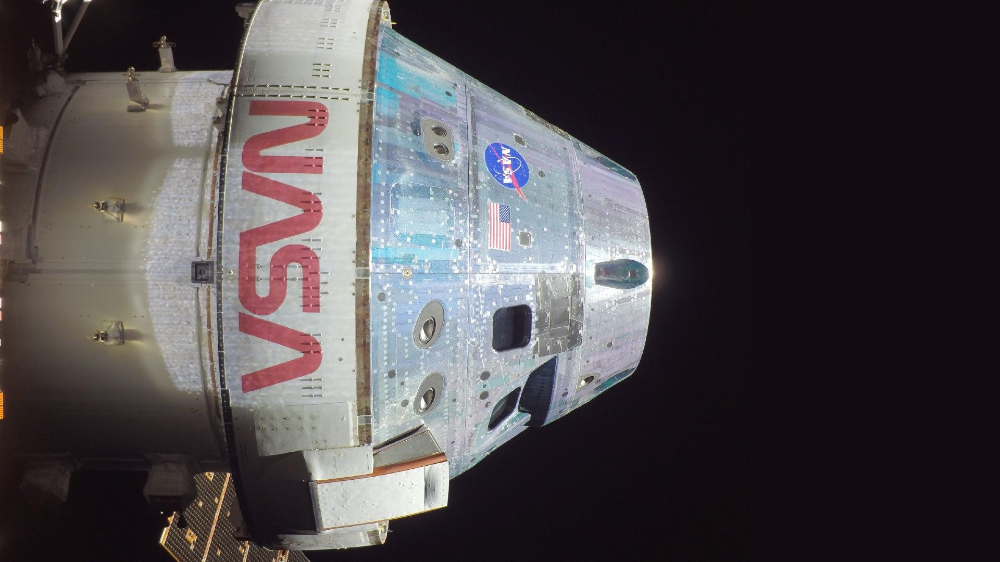

# 流星暴雨撞上 Artemis 4 窗口：NASA 评估未来月球任务与天外来客的博弈

**摘要：** 6 月 7 日 Space.com 报道指出，Artemis 4 作为 NASA 自阿波罗时代以来首次载人月面任务，预定 2028 年初发射，其任务窗口恰与英仙座流星暴雨预测爆发期（2028 年 8 月 12 日）形成潜在冲突。美国流星协会（AMS）Fireball 报告协调员 Robert Lunsford 在接受 Space.com 采访时透露，未来十年内可能出现的 4 次流星暴雨预测中，2033 年与 2034 年的狮子座流星雨也在列。NASA 流星体环境办公室负责人 Bill Cooke 强调，1000 多个已知流星雨中只有极少数（如双子座流星雨）超出偶发背景 5%。Orion 飞船已针对微流星体与空间碎片（MMOD）开展超高速冲击测试，而 STS-51 发现号航天飞机 1993 年的延期与 2000 年范登堡一次无人科学任务的推迟，验证了 NASA 在面对此类风险时延后发射的既有先例。

## 来自宇宙的定时炸弹

NASA 估计，每天约有 48.5 吨（44,000 公斤）的天然空间碎片坠入地球大气层，颗粒尺寸从亚毫米级的微流星体到能划出壮观火球的较大石块不等。每当地球穿行于彗星或小行星长期撒落的碎片流时，近地空间就会变得格外拥挤。微流星体在太空中以平均 22,000 英里/小时（约 34,405 公里/小时）的速度飞行——这意味着即便是一粒沙子大小的颗粒，击中高速飞行的航天器时也会释放出惊人的动能，足以穿透或变形飞船外壳、损坏关键系统，甚至在最坏情况下触发灾难性破裂。

风险点还延伸到 Orion 飞船耐热外层瓦：一旦微流星体在月地转移轨道上撞穿这些隔热单元，飞船再入大气层时的热防护就会被打上折扣。NASA 在文章中提及，去年 11 月中国神舟二十号飞船航天员陈冬在舷窗上发现一道裂缝，这一事件再次提醒业界，即便在低地球轨道上，微流星体与空间碎片的威胁也从未真正远离。

## Orion 的铠甲与超高速冲击测试

Orion 飞船从设计之初就把 MMOD 防护作为刚性指标。NASA 在文章中引用项目工程师 Heckwolf 的解释：飞船的材料选择与厚度都针对微流星体与轨道碎片进行了优化，超高速冲击测试的目的就是确认撞击物理、刻画损伤存活边界、并验证 Orion 抗 MMOD 设计的实际表现。Artemis 任务的轨道剖面与发射窗口同样会经过定期的微流星体环境风险评估，只有最严重的事件才会真正构成发射决策的变量。

Bill Cooke 在 Space.com 的一封邮件中提供了一个定量参考：1000 多个已知流星雨中，只有极少数（如每年 12 月的双子座流星雨）能把流星活动拉到偶发背景之上 5%——这是衡量"普通"与"异常"的分水岭。对于绝大多数发射窗口而言，风险评估会得出"可接受"的结论；但当一次预报中的"流星暴雨"或"异常爆发"恰好叠在任务剖面或舱外活动时段上时，结论就会翻转。

## 下一个十年的 4 次红色日历

Lunsford 透露，AMS 目前已经识别出未来十年内 4 次可能的流星异常爆发：英仙座 2028 年 8 月 12 日，狮子座 2033 年 11 月 17 日，以及 2034 年 11 月 18 日与 19 日两个连续的狮子座峰值。文章同时指出，Artemis 4 目前计划 2028 年初发射，但任何意外延期都可能把窗口往后推，恰好与英仙座异常爆发撞期。一旦出现这种极端巧合，任务延期是合理的选项——这不是 NASA 第一次为流星雨让路。1993 年，STS-51 发现号航天飞机任务为避开英仙座流星雨峰值而推迟；2000 年，范登堡太空军基地的一次无人科学任务为绕开狮子座流星雨异常爆发而调整发射日期。

NASA 也在 JWST 哈勃等旗舰轨道望远镜上部署了类似协议：在重大流星雨期间，把大口径主镜指向偏离辐射点的安全方向，以减小暴露面积。

## 中国航天的相邻问题

文章将中国神舟二十号去年 11 月的舷窗裂缝事件作为相邻案例提及，但未展开细节。该事件曾迫使神舟二十号乘组改用神舟二十一号返回舱着陆，本身是中国载人航天在微流星体与空间碎片防护上的重要警示信号——近地轨道的窗口玻璃厚度、损伤容限与定期检查机制都因此被重新审视。在 Artemis 4 走向月球的同一时期，中国载人登月计划也在并行推进，国际同行对 MMOD 风险的研究、测试与运营经验，对所有准备离开近地空间的载人任务都有借鉴价值。

## 调研说明

本文综合自 Space.com 6 月 7 日发表的 Meteor Storms 风险评估文章，正文细节均来自原文转述或直接引用；中文表述由英文原文翻译整理，未额外补充未在原文中出现的事实。神舟二十号舷窗裂缝事件仅作为相邻案例被原文提及，本文未在中国国内权威来源中独立交叉核对最新进展，读者如需深入了解该事件背景，请参考 CMS 官方后续发布。中国 Artemis 4 任务时间表与风险评估数据来自 NASA 与 AMS 的公开声明，截至 2026 年 6 月 7 日。

## 中英术语对照表

| 中文 | 英文 | 简注 |
| ------ | ------ | ------ |
| 微流星体与空间碎片 | Micrometeoroid and Orbital Debris (MMOD) | NASA 风险评估标准术语 |
| 超高速冲击测试 | Hypervelocity impact testing | 用于验证 MMOD 防护设计 |
| 流星暴雨 / 异常爆发 | Meteor storm / outburst | 显著超出偶发背景的强流星事件 |
| 偶发背景 | Sporadic background | 日常微流星体流量基线 |
| 流星体环境办公室 | Meteoroid Environments Office | NASA Marshall 下属机构，负责人 Bill Cooke |
| 美国流星协会 | American Meteor Society (AMS) | Fireball 报告协调员 Robert Lunsford |
| 月地转移轨道 | Trans-lunar injection / cislunar trajectory | 飞船从近地轨道飞向月球 |
| 隔热瓦 | Heat-resistant outer tiles | Orion 再入大气层热防护 |
| 狮子座流星雨 | Leonids | 2033/2034 年可能异常爆发 |
| 英仙座流星雨 | Perseids | 2028 年 8 月 12 日可能异常爆发 |

## 信息来源（原文）

- [Could meteor storms harm NASA's future moon missions? — Space.com](https://www.space.com/space-exploration/human-spaceflight/could-meteor-storms-harm-nasas-future-moon-missions)
- [NASA Meteoroid Environments Office](https://www.nasa.gov/meteoroid-environments-office/)
- [American Meteor Society — Outburst predictions](https://www.amsmeteors.org/meteor-showers/outbursts/)
- [NASA Artemis Program overview](https://www.nasa.gov/humans-in-space/artemis/)
- [Orion spacecraft — NASA](https://www.nasa.gov/exploration/systems/orion/index.html)
