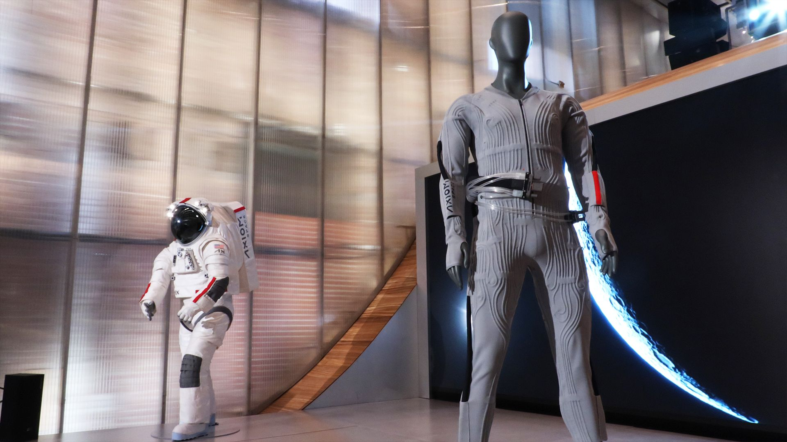

# Prada 联手 Axiom 公布 Artemis 登月宇航服内层冷却衣

**摘要:** 2026 年 6 月 7 日，意大利时装品牌 Prada 与美国航天公司 Axiom Space 在纽约 Prada 门店举行发布会，正式揭晓为 NASA Artemis 登月任务设计的液冷通风服(LCVG)——宇航员在 AxEMU 登月宇航服内穿着的功能性内层 garments。这款 LCVG 融合了航天工程与高端时装设计，是阿波罗时代以来首款为月球表面作业设计的冷却内层 garments。

*Prada 与 Axiom Space 联合设计的液冷通风服(LCVG)。(图片来源：Axiom Space)*

## Prada 进军航天：从 T 台到月球

Axiom Space 高级副总裁 Russell Ralston 在发布会上介绍："这是宇航员在宇航服内穿着 garments，为其提供舒适性、冷却和湿度管理。"LCVG 的外观类似高端运动服饰——V 领设计、拇指扣袖口、复古踩脚裤脚、功能性管道系统，以及 Prada 标志性的红色条纹装饰。

Axiom Space 总裁兼首席执行官 Jonathan Cirtain 表示："物理学和航空工程领域并不常开发出在美学上令人愉悦的产品。但美学与工程性能同等重要——Prada 的设计专长让我们在这两方面都实现了突破。"

## 从 Apollo 到 Artemis：登月冷却 garments 的演进

液冷通风服并非全新概念——阿波罗时代的宇航员就已穿着类似 garments 在月球表面活动。但 Artemis 任务面临截然不同的挑战：NASA 计划在月球南极着陆，该区域地形复杂，永久阴影坑温度极低，而阳光直射区温度极高，对 garments 的温控性能提出了更高要求。

Cirtain 指出："月球南极是一个非常复杂的环境，因此我们在过去的技术基础上做了大量有趣的升级。"新款 LCVG 与 AxEMU 宇航服已通过多项温度、重力及其他环境测试。

## 面向未来的规模化愿景

Axiom Space 的目标不仅限于为 Artemis 任务提供少数几套 garments。Ralston 表示："我认为这对于太空飞行新时代至关重要——我们希望看到成千上万甚至数百万人进入太空。我们不能再沿用过去的方式了。"

这意味着 LCVG 需要在保证航天级性能的同时，实现更高效的人体适配和规模化生产潜力。Prada 的时装制造经验与 Axiom 的航天工程能力结合，正是为了探索这一可能性。

## 信息来源（原文）

- [Prada and Axiom reveal cooling suit for Artemis astronauts — Space.com](https://www.space.com/space-exploration/human-spaceflight/its-very-aesthetically-pleasing-prada-and-axiom-just-revealed-the-stylish-cooling-suit-artemis-astronuats-will-wear-under-their-spacesuit-on-the-moon)
